# RFC - BAR Modules

## Intro

This is an RFC for **modules**: a way for BAR's Lua to declare its own boundaries.

Pick any behaviour in the game and try to answer "what owns this?". Take transfer — units and resources changing hands between allies. The answer today is spread across a handful of gadgets, a couple of widgets, some modoptions, and a cache or two, and the only way to find the full set is to grep for it. Nothing declares that those pieces belong together, so nothing can be reasoned about as a unit: not tested in isolation, not documented as a whole, not handed to a new contributor intact, and not reused by the next feature that needs the same behaviour.

A module is that missing declaration. It names what it owns, what it depends on, and what vocabulary it publishes. The framework loads it and wires it up. When one module requires another, the required module's vocabulary becomes available — so composition happens by declaring a dependency rather than by reaching across the tree.

That has a second effect, which is really the point. Once boundaries are written down, "what module owns this behaviour?" becomes a question with an answer you can point at in code, instead of a discussion about control flow. That is the conversation I want to be having with maintainers, and it is the one this RFC is trying to make possible.

What follows is a working demonstration rather than a proposal on paper: twelve PRs of runtime and modules, a mission written entirely in the resulting DSL, and an editor that is a live view over that Lua rather than a separate format.

### Intended audience

BAR developers, QA, and technical leadership. Please ask me if something is not making sense — the shape of these boundaries is exactly what I want argued with.

### A note to maintainers

This branch has been restacked and the per-step commits squashed. Each PR is one layer, and each diff is scoped to that layer alone, so they are meant to be read top to bottom rather than commit by commit.

## Branch Structure

Twelve PRs, each based on the one below it. Listed bottom-up, so the first one
targets `master` and each subsequent one targets its predecessor:

1. [#8484](https://github.com/beyond-all-reason/Beyond-All-Reason/pull/8484) `modules: the module runtime` — manifests, requires, auto-loading
2. [#8485](https://github.com/beyond-all-reason/Beyond-All-Reason/pull/8485) `modules: context` — one factory for every kind of context
3. [#8486](https://github.com/beyond-all-reason/Beyond-All-Reason/pull/8486) `modules: the mode grammar` — what a game mode is allowed to say
4. [#8487](https://github.com/beyond-all-reason/Beyond-All-Reason/pull/8487) `modules: one owner of the verdict` — match start, win, loss
5. [#8488](https://github.com/beyond-all-reason/Beyond-All-Reason/pull/8488) `modules: the trigger runtime and the authoring DSL` — `When ... Do ...`
6. [#8489](https://github.com/beyond-all-reason/Beyond-All-Reason/pull/8489) `modules: the served editor` — the language server, the form, the VS Code plugin
7. [#8490](https://github.com/beyond-all-reason/Beyond-All-Reason/pull/8490) `modules: tech tiers`
8. [#8520](https://github.com/beyond-all-reason/Beyond-All-Reason/pull/8520) `modules: construction policy` — what may be built, and by whom
9. [#8524](https://github.com/beyond-all-reason/Beyond-All-Reason/pull/8524) `modules: economy` — how a shared pool is distributed
10. [#8521](https://github.com/beyond-all-reason/Beyond-All-Reason/pull/8521) `modules: allied transfer` — one place that moves units and resources between teams
11. [#8522](https://github.com/beyond-all-reason/Beyond-All-Reason/pull/8522) `modules: combat, protection as a lifetime` — `Protect ... Until`
12. [#8494](https://github.com/beyond-all-reason/Beyond-All-Reason/pull/8494) `missions: CM8 Ashfall` — the demo, written entirely in the DSL

They are all drafts. [#8467](https://github.com/beyond-all-reason/Beyond-All-Reason/pull/8467)
(`gui_chat: finish the state-table refactor`) is **not** part of this stack — it
was, back when the modules stack was pushing `gui_chat.lua` at the 200-local
ceiling, and it is worth having on its own merits, but nothing here depends on it
any more.

That order is a queue, not a dependency — most of these only need the runtime at the bottom, so most of them could land in any order. The real shape is the module dependency graph.

That module dependency graph is in our new VSCode BAR plugin:

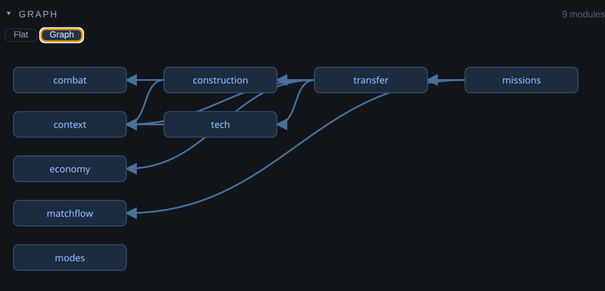

So the branch exists with foundational commits, then modules layered on top.

## Demo v1

### Mission 8: Ashfall

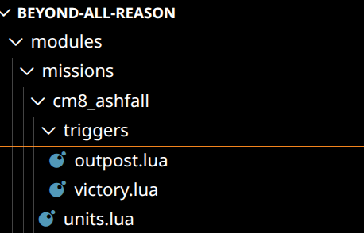

#### Spawning Units

##### `cm8_ashfall/units.lua`

```lua
Spawn(UnitDef("corlab"), "gaia")
	.At(0.42, 0.42)
	.Named("outpost_command_hub")
	.Grouped("outpost_auto")

Spawn(UnitDef("corllt"), "gaia")
	.At(0.39, 0.40)
	.Grouped("outpost_auto")
...
```

Spawn a unit and give it to gaia, in this named group, after the mission is activated.

In editor:

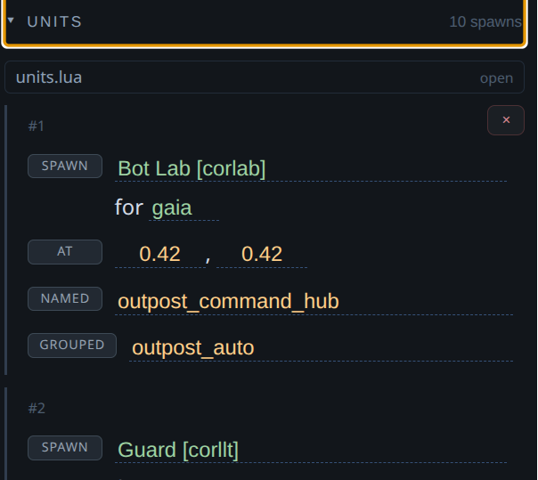

This form in the editor is just a _view_ over the lua file.

#### Triggers

Here is our outpost trigger as shown in the VSCode Editor:

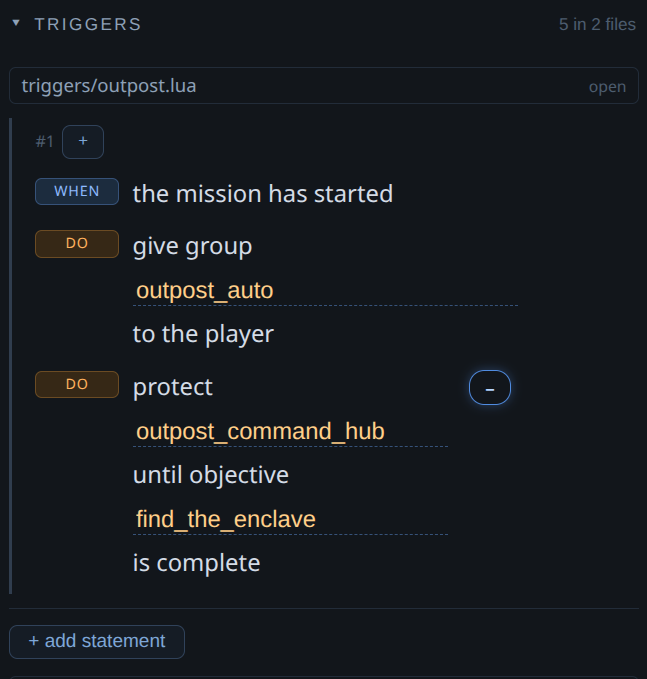

If you click on the trigger row, it takes you to the code:

##### `cm8_ashfall/triggers/outpost.lua`
```lua
When(MatchFlow.Started())
	.Do(Transfer.Give("outpost_auto", Team.Player))
	.Do(Combat.Protect(Unit("outpost_command_hub"))
		.Until(Objective("find_the_enclave").IsComplete()))
```

 `MatchFlow.Started()` works because that tells our behavior engine "hey, once the match started, I need you to do x, y, and z". You don't care about the order, you just need that stuff to happen when the prerequisites are met. So you declare your intent and trust that it will happen.

##### Architectural Note

1) Notice how the handover is a `Transfer.*` action — the same module that moves units between allies in multiplayer. One module owns "things change hands", so a scripted mission handover and a player pressing the share button are the same pipeline, and the policies driving it change through knobs on the transfer module API.

   The mission says `Transfer.Give` rather than `Transfer.Units` on purpose, and the distinction is the whole argument in miniature. `Transfer.Units` asks the active mode whether it's allowed and what it costs; `Give` is fiat — the giver is the game itself, not a team choosing to share. A scripted handover must not be silently refused because the lobby happens to be running a no-sharing preset. That's not a special case bolted on: `Give` simply declares no mode facet, so no mode can speak about it, and you can see that in the action table rather than having to find out at runtime.
2) The `Combat.Protect` clause is an _effect_ the trigger runs; the interesting part is `.Until(...)`, which arms a companion trigger at the moment protection is applied - that's the event hook, and it's why the lifetime can't leak. This may be obvious, but it's worth stating because it's not always clear to people who don't have a lot of experience in functional code: just because this implementation factors this through a functional lens, doesn't mean we can't install things like Event hooks through this DSL. We don't have to go on an exhaustive hunt and rip out all state from every module and make a perfect functional reduction right away. We can do that incrementally while we also version and publish our own API -- in a way that it is _honest_ about the current limitations, explicit in its own API expression.

##### `cm8_ashfall/triggers/victory.lua`

In editor:
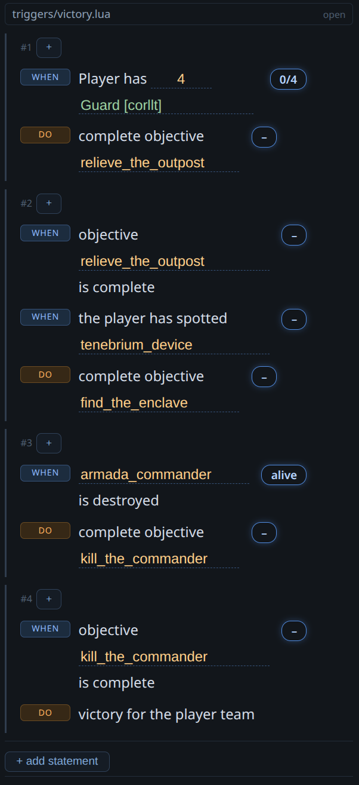

The code:
```lua
When(Team.Player.Has(UnitDef("corllt"), 4))
	.Do(Objective("relieve_the_outpost").Complete())

When(Objective("relieve_the_outpost").IsComplete())
	.When(Unit("tenebrium_device").IsSpotted(Team.Player))
	.Do(Objective("find_the_enclave").Complete())

When(Unit("armada_commander").IsDestroyed())
	.Do(Objective("kill_the_commander").Complete())

When(Objective("kill_the_commander").IsComplete())
	.Do(MatchFlow.Victory(Team.Player))
```

Everything is intent. You tell us what you want to do declaratively, the framework makes sure it's done for you at the right moment.

## The editor

### The form understands the Lua

The editor itself is by design guaranteed to be a (isomorphic) representation of the LUA file. Because our language server understands our code, the editor can surface that understanding to the user in a way that is structured and enriched with domain understanding.

### Editor Form Features

The **Mission Editor Overview** breaks down module complexity by category and contains breadcrumbs for navigation back to other missions:
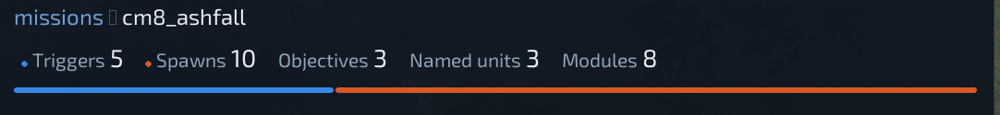

The **Nouns** section extracts runtime facts:
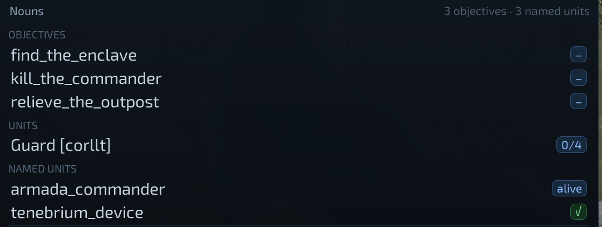

The **Status Badges** across all sections update in real time:
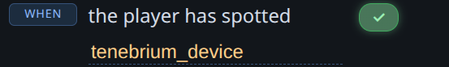

The **Reference Modules** section:
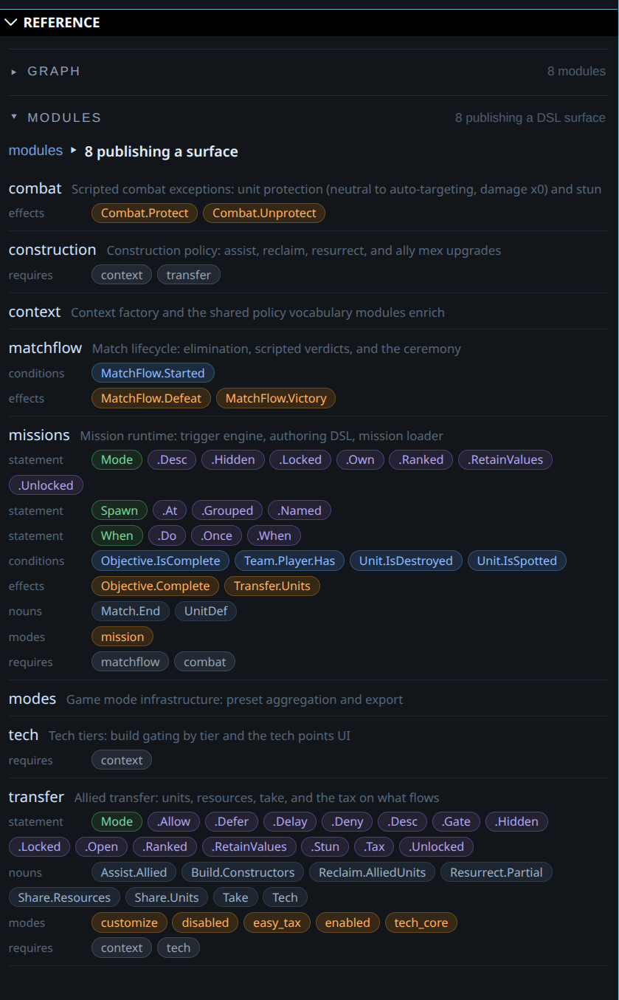

Notice how these sections are entirely code-genned. They surface the [ubiquitous language](https://martinfowler.com/bliki/UbiquitousLanguage.html) of the domain in a way that QAs and developers can both understand, test, and iterate on atomically.

The UI also demonstrates how it can be chained; each "statement", "condition", "effect", "noun", and "mode" is self-documenting, semantically coherent and grouped in a way that demonstrates the form _understands_ the code it overlays.

### Editor Code Features

* Intellisense works great
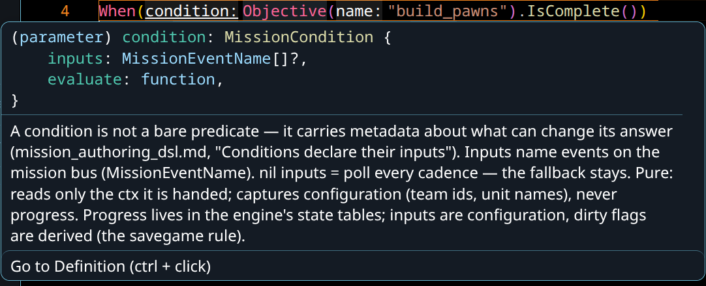
* nav-to-definition and f2 rename — the DSL is just typed Lua, so EmmyLua gives us these for free
* we can use the fact that our form has an enricher to also enhance the code, for example, UnitDef wrappers that warn you on a typo:

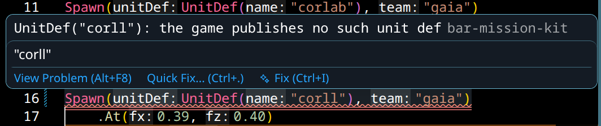

### The plugin ships the language server

You do not need BAR-Devtools to use any of this. If you want to hack on the server, run your own with `just bar::mission-serve` — the plugin adopts whatever is already answering and only starts its own when nothing is.

### The Code is a **subset** of Lua

Because this is a STRICT subset of Lua (the game's own verbs), it is unbelievably safe for us as maintainers. You can only call our own API at the moment and make it through a CI gate (or mod hub check) on your code. But we do probably want to loosen that gradually and at least permit like...math.

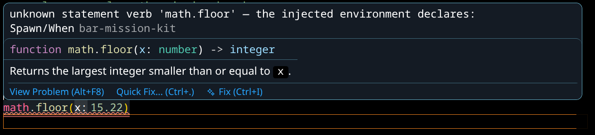


### DSL Code Genned Forms Are God-Tier UIs

Because this is a parser, we get no-cost module expansion from a tooling PoV. If you add a new module vocabulary that doesn't have edit functionality for its own primitives baked yet, the form falls back to just rendering the DSL in the form inline -- which totally reads and works correctly from day 0 developing a new module.

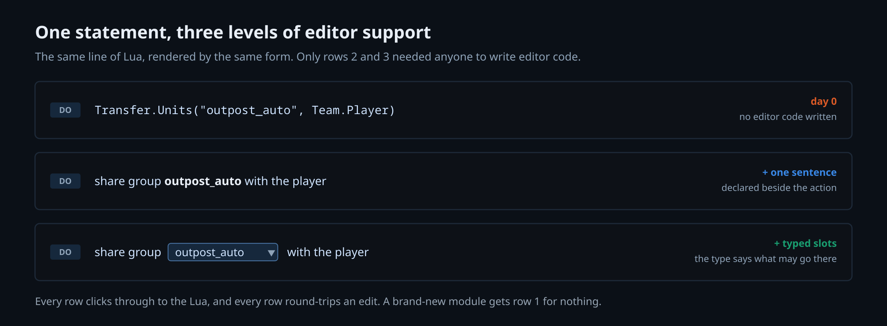

You can still navigate to your statements in Lua from the form and QA can still see your API shape without either of you adding or understanding any of the editor form functionality.

## Modules

Modules give developers a primitive to express boundaries to each other and the framework. They enable modules to expose new vocabulary through composition. If the mission team requires your module in the mission module -- boom! your module API/new vocabulary is now available in missions.

Modules publish **actions**, which are individual commands or queries that modify state (`Transfer.Units`) or answer questions (`Objective.IsComplete`, `Unit.IsDestroyed`), and rules are written over them in **policy language** (trigger or mode) - and within a mode chain there are three statement kinds.

* **Grants** - Allow/Deny actions.
* **Parameters** - Tax, Stun, Delay, Gate, Open, Defer
* **Modifiers** - Ranked, RetainValues, Desc, Hidden, Locked, Unlocked.

Modifiers provide global locks on inputs in the lobby or provide metadata for the global configuration (Desc, Ranked, RetainValues tells the mode to keep the last mode's selected values, when switching into that mode). Grants permit actions. Parameters modify policy.

### Modes

Modes are the _top-level_ configuration primitive for the global restrictions of behavior. They are each a self-contained closure. There can only be 1 mode per _category_ (for example, "sharing" and "missions" are categories). There are therefore two mode grammars in the demo: `missions/lib/mode_dsl.lua` and `transfer/mode_dsl.lua` are separate vocabularies that share the Mode() statement head. This means mission modes can't tax and Transfer can't own MatchFlow verdicts. In this way, each module can declare its own bespoke modes.

Here is a multiplayer mode (that we're all familiar with) to show more:

`transfer/modes/easy_tax.lua`

```lua
local ModeDSL = VFS.Include("modules/transfer/mode_dsl.lua")
local Mode, Transfer, Construction, Take =
	ModeDSL.Mode, ModeDSL.Transfer, ModeDSL.Construction, ModeDSL.Take

return Mode("Easy Tax")
	.Desc("Anti co-op sharing tax mode. Tax on resource sharing, assist, and resurrection. Eco buildings stunned, mobile constructors debuffed.")
	.Ranked()
	.Allow(Transfer.Units)
	.Stun(Transfer.Units.Resource, 30)
	.Delay(Construction.Build, 30)
	.Allow(Transfer.Resources)
	.Tax(Transfer.Resources, 0.30)
	.Allow(Construction.Assist)
	.Allow(Construction.Reclaim)
	.Allow(Construction.Resurrect)
	.Stun(Take)
	.Delay(Take.Resource, 30)
```

The module name is the vocabulary prefix, so a preset tells you which module owns
each line. `Construction.*` appears in a transfer mode because construction
declares what a builder may do for an ally and transfer requires it — the
grammar composes across the dependency edge, and a preset still reads as one
list.

Let's go over the modules contained in this demo.

### Demo Modules

- **context** — the factory every other module builds its decision context from, plus the shared policy vocabulary they enrich. No dependencies.
- **modes** — the mode machinery itself: how a preset is declared, aggregated, and exported to modoptions so the lobby can set it. No dependencies.
- **matchflow** — owns the verdict: match start, elimination, scripted win/loss, and the ceremony that follows. No dependencies.
- **combat** — scripted combat exceptions: protection (neutral to auto-targeting, damage ×0) and stun. No dependencies.
- **economy** — how a shared pool is distributed: the waterfill solver. It answers a question that is not about allies at all — given a pool, a set of claimants and their capacities, how much does each get — so it sits *under* the modules that have a reason to ask. No dependencies.
- **tech** — what a team may build at its tier: the gate, and the tech points UI. → context
- **construction** — what may be built and by whom: assist, reclaim, resurrect, ally mex upgrades, and the build delay. → context
- **transfer** — one pipeline for everything that changes hands between allies: units, resources, `/take`, and the tax on what flows. → context, tech, construction, economy
- **missions** — the trigger runtime: the `When … Do` engine, the authoring DSL, and the loader that arms a mission as a single transaction. → matchflow, combat, transfer

Two of those edges are worth pointing at, because they are the ones that moved
during review and they moved for reasons you can argue about — which is the
point of writing them down.

`transfer → construction`, not the other way round. Both directions have a
story: assisting an ally is arguably a kind of sharing, so it could hang off
transfer; but building is the more primitive idea, and construction has no need
to know that allies exist. It reads better at the base, so it went there and
transfer requires it.

`transfer → economy` exists because the waterfill solver isn't a sharing concept
that leaked downward — it's a pool-splitting algorithm that sharing happens to
be the first caller of. Making it its own module means the next thing that has
to split a pool asks the same solver instead of growing its own.

## Testing

### The specs run in the CI job we already have

35 spec files, 351 `it()` blocks, living next to the module they test —
`modules/transfer/spec/`, `modules/missions/spec/`, and so on. No new pipeline:
`.busted` discovers any `modules/*/spec/` directory generically, so the existing
`test_unit` workflow picks up a new module's specs the moment the directory
exists. A module ships its tests the same way it ships its gadgets.

This is a large part of why the boundaries are worth drawing. Most of what these
modules decide is now a pure function of a context table — "may this transfer
happen, and what does it cost" is answerable without a running engine — so it
gets tested as a policy rather than as a gameplay symptom.

### The in-game authoring loop

There are three verbs, all under `/mission`:

```
/mission load <name>
/mission reload
/mission editor
```

`load` and `reload` are synced (a gadget chat action); `editor` is unsynced (it
opens the RmlUi panel). The panel and the chat command both come through the
same declared action, so the guard and the transaction happen once each rather
than once per caller.

**`reload` is a fresh run, not a hot patch.** It re-reads the trigger files,
replaces the armed set wholesale, clears objective progress, and despawns and
respawns the roster. That is deliberate — a completed objective must not survive
into the next run and re-fire victory on the following cadence — and in practice
it is what you want while iterating: nothing accumulates state worth preserving
between runs.

**Rosters are positioned in map fractions today, not coordinates.** `At(0.42, 0.42)`
means "42% across, 42% down", so a mission under development plays on any test
map. That is scaffolding for the current phase, where I am testing trigger
behaviour and the campaign maps do not exist yet; a finished mission pins real
coordinates and is map-bound like you would expect. Missions have historically
been script files and they still work the same way — they just live in a module
now.

### What guards it

`ChatGuard.IsAllowed(isSinglePlayer, cheatsEnabled)` — singleplayer always, or
cheats on. In multiplayer any player can send a synced chat action, so arming or
reloading a mission must not be an open verb. The guard is a pure function with
its own spec, and it sits on the command rather than inside the loader, because
*who may ask* is the channel's business and *is this a real mission* is the
action's.

On top of that, `missions/modes/mission.lua` is a mode like any other, so
"missions are on" is a lobby-visible setting and not an ambient runtime state:

```lua
return Mode("Mission")
	.Desc("Triggers own the verdict; engine elimination never ends the match.")
	.Own(Match.End)
```

## Opinions

###  "That's not how the game industry does it!"

@attean

Nonsense. This argument immediately breaks down under scrutiny. We have the same solutions already (caching, state machines, service layers through singletons) but they're just distributed throughout the code base instead of living in either the framework, or a module, and that is problematic because it's harder to generalize solutions. This factoring is easier for us because we can put **all** the foot guns in the framework box.

I don't know another way to decompose state in an incremental way into domain modules, other than to actually go and start to do that.

### Module dependency graphs seem too complex?

@attean

"Woh, woh, woh, slow down!", I hear you say. "Dependency graphs?! What is this madness?! I don't want to know this stuff!"

But you have to. These modules are our best-known expression of _our_ domain (RTS behavior) boundaries. They are exactly what we should all be discussing, all the time. Right now, in engineering anyway, we're discussing a lot of control flow, which is a smell. How can we make our domain more comprehensible and easy to read? If there are actual dependencies between modules, making that explicit and auto-documented at edit-time helps QA debug it better and helps developers to focus on specific, incremental verbs as they're building out features.

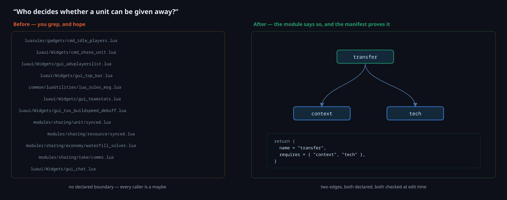

## Conclusion

@attean

I think that, to some extent, maintainers _MUST_ do large parts of this state decoupling in order to move with any velocity and eventually support modding.

This is the dev story I wanted to tell after I looked at a random problem (transfer and, quixotically enough, how to move `/take` out of Recoil), and I am very priveliged to have been able to prototype it out over the last however many months. It's pretty cool to me that I can kind of go through high level discovery and prototype tooling in a week, and then maybe have the conversation about module boundaries that I want to be having with yall instead, and with a broader audience because we surfaced the Lua API in a self-documenting way.

Also shout out to @NortySpock and @Harkenn for challenging me, @Boneless for paying attention to BAR, and @sprunk for stopping my premature engine PRs -- in order to bring this into this form. This is better than the half measure that tried to dodge having the framework conversation (and I think we can all see why :sweat:), but it's a much better demonstration for having pushed it a little further.

This is also a handoff of sorts from me on these ideas. Not to imply that I'm done working on this, but more that this is that communication's final form. I believe this is a comprehensible shape so I will iterate on and validate that shape, but this is enough for the demo.

"What module owns our behavior?" is the right conversation that we as contributors should be having with maintainers -- and that question being laser focused within the organization as a transparent artifact, in code, will intrinsically reduce all manner of time spent on debugging and on drama between the various stakeholders vying to control the One True Runtime State Implementation that isn't intrinsically factored to be composable. In summary, we have to do something like this and this is _one version_ of it that satisfies the requirements and then some. Some of the most successful UIs (commercially and in terms of maintenance) that I have ever built have been this exact same approach, so my confidence in these refactoring and tooling approaches is extremely high.
