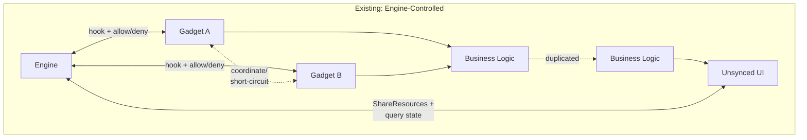
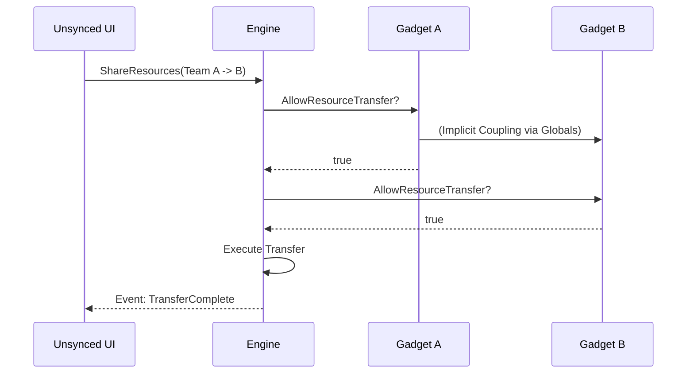
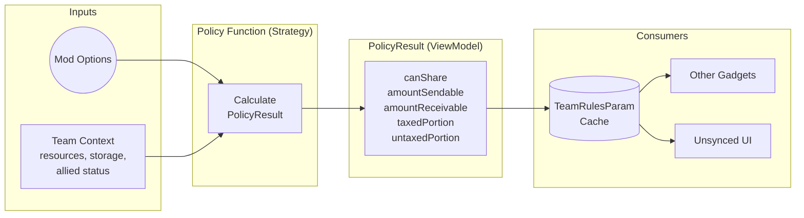
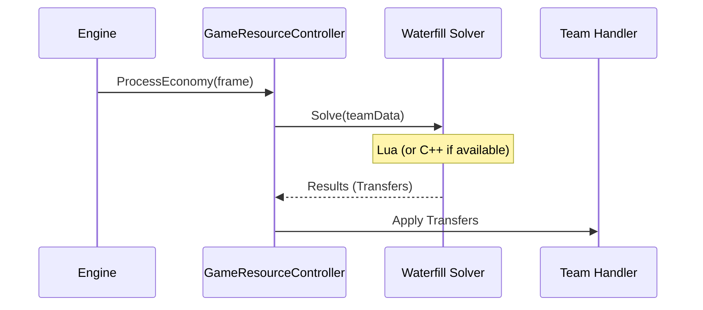
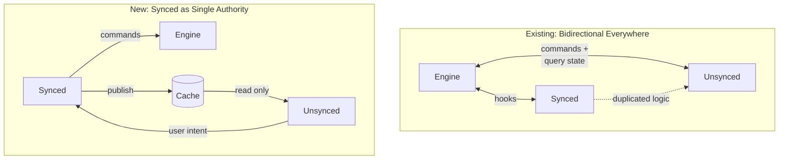

# Game Controllers & Policies: A New Architecture for Game Behavior

## Introduction

Right now, the gadget system as it pertains to unit and resource transfers is baked into the engine. It is assumed that the engine will be controlling those transfers internal to the hook system it exposes.

I started my discovery process trying to remove the `capture` parameter from the `AllowUnitTransfer` hook, and to move `/take` out of the engine. Pretty quickly I asked the question:

> Why does the engine care about these transfers at all? Why does the synced layer, which owns the configuration and domain logic, not just tell the engine what to do so we can modularize this subsystem?

The answer for why we prefer per-team gadget hooks is mostly because it offers granular control to gadgets, and gadgets are a production-tested framework for devs to control game behavior.

But what if, when a behavioral subsystem called for it and that part of the sim DID belong entirely to the game, we had a different pattern? One where the game is assumed to control the state of that subsystem entirely?

### A Note on Scope: Now vs. Next

This document presents **two iterations** of this architecture:

1.  **Now** (`sharing_tab` branch): A working implementation using Controller gadgets and PolicyResult caching. This is what I'm proposing we merge.
2.  **Next** (prototyped in a separate worktree): A more ambitious DSL-based policy engine that the "Now" architecture directly enables.

I'll walk through the "Now" implementation in detail, then show a glimpse of "Next" to demonstrate where this pattern leads.

### UX Goals
* **Cardinal mod options**: Each mod option does exactly 1 functional game behavior. No "Nuclear Options" or "Easy Sharing Tax" that incorporate multiple surprising behaviors. Instead: "Unit Sharing Mode", "Tax Rate", "Ally Assist Mode", etc.
* **Sharing modes exist** [PR](https://github.com/beyond-all-reason/BYAR-Chobby/pull/1041): Can disable, hide, lock, and show specific mod options with declarative configuration. This eliminates the "Easy Sharing" problem, where one checkbox does multiple behaviors, while still preserving the option for devs to name their own modes.

### Architecture Goals
* **Synced domain layer**: Declarative, idempotent, centralized behavior logic.
* **Performance**: Optimized Lua algorithms for redistribution (Waterfill), with optional C++ acceleration.
* **Testability**: Logic that can be tested without running the game.

### A Word on the Implementation

This branch is a stepping stone. I originally built a more complete framework, realized it was too big a leap, and backported the core patterns without the scaffolding. You'll see functions treated as atomic units with full EmmyLua decorators—this is intentional. When you're not sure where code will live long-term, portability matters.

The goal here is singular: **invert control from the engine to the synced layer**. Demonstrate that the game can own a subsystem completely. The "used once" value objects and explicit typing may look over-engineered for what's merged today, but they're load-bearing for what comes next.

---

## 1. The Existing System: "The Spaghetti"

The existing gadget system is powerful but assumes control flow *originates* from the engine for subsystems the engine doesn't actually understand. This leads to a bidirectional dependency mess where gadgets fight each other.



### The "Loop of Death"
In the current system, a simple resource transfer request travels through a perilous journey of hooks, return values, and side effects.



### Problems
1.  **Loop-back pattern**: `AllowResourceShare` returns to caller; order of gadget execution matters.
2.  **Gadget coupling**: Gadgets must know about each other to coordinate policies.
3.  **Duplicated logic**: UI and gadgets both implement "can share?" checks.
4.  **Untestable**: You cannot test `Gadget A` without running `Spring`, `Gadget B`, and `UI`.

---

## 2. The Solution: Controllers & Policies

To solve this, we invert the control. We introduce a **Service Layer** (Controllers) and a **Strategy Pattern** (Policies).

### The Service Layer (Controllers)
Instead of the engine asking "Can I do this?", the engine asks the game "What should I do?".

We add a switch `modInfo.game_economy = true`. When enabled, the engine delegates the entire economy resolution to a synced gadget via [`Spring.SetEconomyController`](https://github.com/keithharvey/bar/blob/sharing_tab/luarules/gadgets/game_resource_transfer_controller.lua#L350).

### The Strategy Pattern (Policies)
Because the game controls execution, it can expose that execution to "policies" as swappable components.



A **Policy** is a pure function. Given mod options and team context, it produces a `PolicyResult`. This result is cached in `TeamRulesParams` and acts as a **ViewModel** for the UI. The UI never calculates business logic; it just reads the cached policy.

---

## 3. Deep Dive: A Policy In Action

Let's look at the actual tax policy from the `sharing_tab` branch.

**[resource_transfer_synced.lua](https://github.com/keithharvey/bar/blob/sharing_tab/common/luaUtilities/team_transfer/resource_transfer_synced.lua)** — The core policy logic.

```lua
---@param ctx PolicyContext
---@param resourceType ResourceType
---@return ResourcePolicyResult
local function calcResourcePolicyResult(ctx, resourceType)
  local receiverCapacity = receiverData.storage - receiverData.current
  local cumulativeSent = Shared.GetCumulativeSent(ctx.senderTeamId, resourceType, ctx.springRepo)
  local threshold = getThreshold(resourceType)
  local allowanceRemaining = math.max(0, threshold - cumulativeSent)
  local senderBudget = math.max(0, senderData.current)

  local untaxedPortion = math.min(allowanceRemaining, senderBudget)
  local effectiveRate = (taxRate < 1) and taxRate or 1
  local taxedSendable = math.max(0, (senderBudget - untaxedPortion) * (1 - effectiveRate))

  return {
    canShare = receiverCapacity > 0 and amountSendable > 0,
    amountSendable = amountSendable,
    taxedPortion = taxedPortion,
    untaxedPortion = untaxedPortion,
    taxRate = effectiveRate,
    -- ... other fields
  }
end
```

This is a **pure function**. It takes context, returns a result. No side effects, no engine calls, no global state mutation. This is the core insight: *the policy doesn't do the transfer, it describes the boundaries of what a transfer can be*.

### The Waterfill Solver

One major concern with moving logic to Lua is performance. Resource sharing involves solving a "Waterfill" problem (distributing excess resources fairly) across all allied teams every `SlowUpdate`.

**[economy_waterfill_solver.lua](https://github.com/keithharvey/bar/blob/sharing_tab/common/luaUtilities/economy/economy_waterfill_solver.lua)** — The algorithm.

The solver is implemented in optimized Lua 5.1. While we are bound by the runtime, we have structured the data flow to be efficient using object pooling and cache-friendly iteration. The architecture also allows optional C++ acceleration via `Spring.SolveWaterfill` but so far the LUA tracy results are promising (SlowUpdate is a little faster in the new branch).

```lua
local function solveWithCppOrLua(members, memberCount, taxRate)
  if Spring and Spring.SolveWaterfill then
    -- Use C++ solver if available
    local result = Spring.SolveWaterfill(cppMembersCache, taxRate)
    return result.lift, result.deltas
  end
  return solveWaterfill(members, memberCount, taxRate)
end
```



---

## 4. The Controller: ProcessEconomy

The controller is the glue. It's called by the engine every `SlowUpdate` and orchestrates two distinct phases:

**[game_resource_transfer_controller.lua](https://github.com/keithharvey/bar/blob/sharing_tab/luarules/gadgets/game_resource_transfer_controller.lua#L176)**

```lua
---@param frame number
---@param teams table<number, TeamResourceData>
---@return EconomyTeamResult[]
local function ProcessEconomy(frame, teams)
  -- ...
  
  -- Step 1: Solve redistribution (the math)
  local results = WaterfillSolver.SolveToResults(springRepo, teams)
  
  -- Step 2: Flag policy cache for deferred update
  pendingPolicyUpdate = true
  pendingPolicyFrame = frame
  
  return results
end

local function DeferredPolicyUpdate()
  if not pendingPolicyUpdate then return end
  pendingPolicyUpdate = false
  
  -- ...
  lastPolicyUpdate = ResourceTransfer.UpdatePolicyCache(
    springRepo, pendingPolicyFrame, lastPolicyUpdate, POLICY_UPDATE_RATE, contextFactory
  )
end
```

**Step 1** (Waterfill) runs in the hot path and returns results to the engine immediately.
**Step 2** (Policy Cache) is deferred to `GameFrame` to avoid blocking.

---

## 5. Verification: Unit Testing

This is the biggest win. Because the logic is decoupled from the engine loop, we can test it in isolation.

We don't need to boot the game to verify that tax calculations are correct. We can run specs against the Lua policies directly.

**[game_resource_transfer_controller_spec.lua](https://github.com/keithharvey/bar/blob/sharing_tab/spec/luarules/gadgets/game_resource_transfer_controller_spec.lua)**

```lua
describe("WaterfillSolver.SolveToResults", function()
  it("balances metal between teams without tax", function()
    local teamA = Builders.Team:new():WithMetal(800)
    local teamB = Builders.Team:new():WithMetal(200)
    
    local results = WaterfillSolver.SolveToResults(mockSpring, {teamA, teamB})
    
    assert.is_near(500, results[1].current) -- Team A
    assert.is_near(500, results[2].current) -- Team B
  end)
  
  it("applies tax correctly in results", function()
    -- ...
    assert.is_true(teamAMetal.sent > teamBMetal.received)
  end)
end)
```

✅ **Testable**: Logic verified in milliseconds.
✅ **Safe**: Refactor fearlessly.
✅ **Professional**: Standard software engineering practices applied to game dev.

---

## 6. Comparison Summary



### Benefits of the New Architecture
1.  **Inversion of Control**: Engine calls Controller, not gadgets intercepting engine.
2.  **Single Source of Truth**: Policy cache is read by all consumers.
3.  **Decoupled Gadgets**: Other gadgets query cache, they don't fight each other.
4.  **Performance**: Optimized Lua with optional C++ acceleration.
5.  **Quality Assurance**: Fully unit-testable Lua logic.

---

## 7. The Future: A Policy DSL

The `sharing_tab` branch establishes the foundation. But the architecture unlocks something more powerful: a **declarative DSL** for defining game policies.

In a separate prototype, I've explored what this looks like. Here's the same tax policy, reimagined:

```lua
---@param builder DSL
local function buildPolicy(builder)
  local taxRate = builder.mod_options[ModOptions.TaxResourceSharingAmount] or 0

  builder:Allied():MetalTransfers():Use(function(ctx)
    return calcResourcePolicyResult(ctx, ResourceType.METAL)
  end)

  builder:Allied():EnergyTransfers():Use(function(ctx)
    return calcResourcePolicyResult(ctx, ResourceType.ENERGY)
  end)

  builder:RegisterPostMetalTransfer(function(transferResult, springRepo)
    -- Track cumulative sent for tax-free threshold
    local current = springRepo:GetTeamRulesParam(transferResult.senderTeamId, cumMetal) or 0
    springRepo:SetTeamRulesParam(transferResult.senderTeamId, cumMetal, current + transferResult.sent)
  end)
end
```

The DSL provides:
*   **Fluent API**: `builder:Allied():MetalTransfers():Use(...)`
*   **Declarative intent**: Read what the policy *means*, not how it's wired.
*   **Composability**: Policies are independent modules; the engine composes them.
*   **Shared Infrastructure**: Common functionality (caching, validation, logging) lives in one place, not copy-pasted across gadgets.
*   **Low Barrier to Entry**: Adding a new policy is trivial. Intellisense guides you, the DSL constrains you to valid patterns, and you only worry about *your* policy—not the plumbing. Senior devs build the rails; junior devs ship features.

### Dynamic Behavior: Building Unlocks Sharing

This is where it gets exciting. Imagine a mod option where you can only share resources *after building specific structures*:

```lua
---@param builder DSL
local function policyFunction(builder)
    local function hasBothStorages(ctx)
        return hasBuiltCategories(ctx.senderTeamId, {
            BuildingCategories.METAL_STORAGE,
            BuildingCategories.ENERGY_STORAGE
        }, ctx.repositories.springRepo)
    end

    local function hasPinpointer(ctx)
        return hasBuiltCategories(ctx.senderTeamId, {
            BuildingCategories.PINPOINTER,
        }, ctx.repositories.springRepo)
    end

    builder:MetalTransfers():When(hasBothStorages):Allow()
    builder:EnergyTransfers():When(hasBothStorages):Allow()
    builder:UnitTransfers():When(hasPinpointer):Allow()
end
```

This is **game design expressed as code**. No engine changes required. No hook ordering nightmares. Just declare what you want.

### Potential File Layout

```
luarules/modules/
├── policy_engine.lua           # Shared AST-like rule pipeline
├── dsl.lua                     # Shared fluent builder API
│
├── team_transfer/              # Economy & sharing module
│   ├── controller.lua
│   ├── policies/
│   │   ├── tax_resource_sharing.lua
│   │   ├── building_unlocks_sharing.lua
│   │   ├── allied_assist.lua
│   │   └── unit_sharing_mode.lua
│   ├── actions/
│   └── default_results/
│
└── combat/                     # Hypothetical combat module
    ├── controller.lua
    ├── policies/
    │   ├── friendly_fire.lua
    │   ├── capture_rules.lua
    │   └── unit_veterancy.lua
    ├── actions/
    └── default_results/
```

The `policy_engine` and `dsl` are shared infrastructure. Each domain module (team_transfer, combat, etc.) brings its own controller, policies, and default results—but they all compose through the same pipeline.

### A Note on Lua 5.1 Performance

The architect-minded among you may be thinking: *"Isn't Lua 5.1 insanely slow? Don't design patterns thrash the GC because you can't build tables without pooling everything?"*

Yes. Yes it is.

The current implementation works around this with aggressive object pooling and cache-friendly iteration. But the architecture is intentionally designed to be *runtime-agnostic*. If we later transpile these modules to native code (via LLVM or similar), or port to a language with proper value types, the policy/controller separation still holds. The abstractions pay for themselves twice: once in testability today, once in portability tomorrow.

Taken further: native modules could enable Recoil to split into **core** (minimal simulation substrate) and **optional modules** (game behavior). The same pattern we're using here—swappable policies composed by a shared engine—could apply at the engine level. Recoil core handles physics, rendering, networking. Game modules handle economy, combat rules, unit transfers. Each game chooses which modules to load. BAR ships its opinionated defaults; other games swap in their own.

---

## 8. Conclusion: Why This Matters

This isn't just about resource sharing. It's about establishing a pattern for how the game can own its own behavior.

The engine is a powerful simulation substrate. It doesn't need to know about "tax rates" or "unit stun durations" or "building unlock requirements." Those are *game design decisions*. They should live in the game.

What we're proposing:
1.  **This PR**: Controller pattern, PolicyResult caching, testable Lua logic.
2.  **Future PRs**: DSL, policy engine, more subsystems migrated out of engine control.

Just because this is the first "game module" we rip out of `Recoil core` does not mean it should be the last. Resource Transfers, Unit Transfers, Combat behavior—each of these could follow the same pattern.

**The game should be in charge of the game.**

---

## Reference: Key Files in `sharing_tab`

| File | Purpose |
|------|---------|
| [BAR PR - The Sharing Tab](https://github.com/beyond-all-reason/Beyond-All-Reason/pull/5704) | Game-side changes |
| [Recoil PR - Game Economy](https://github.com/beyond-all-reason/RecoilEngine/pull/2664) | Engine-side changes |
| [game_resource_transfer_controller.lua](https://github.com/keithharvey/bar/blob/sharing_tab/luarules/gadgets/game_resource_transfer_controller.lua) | Main controller gadget |
| [resource_transfer_synced.lua](https://github.com/keithharvey/bar/blob/sharing_tab/common/luaUtilities/team_transfer/resource_transfer_synced.lua) | Policy calculation logic |
| [economy_waterfill_solver.lua](https://github.com/keithharvey/bar/blob/sharing_tab/common/luaUtilities/economy/economy_waterfill_solver.lua) | Redistribution algorithm |
| [game_resource_transfer_controller_spec.lua](https://github.com/keithharvey/bar/blob/sharing_tab/spec/luarules/gadgets/game_resource_transfer_controller_spec.lua) | Unit tests |
