# Policy System Architecture: Old vs New

## Old Architecture (AllowResourceShare)

### Problems

1. **Loop-back pattern**: `AllowResourceShare` returns to caller, order of gadget execution matters
2. **Gadget coupling**: gadgets must know about each other to coordinate policies
3. **Duplicated validation**: UI and gadgets both implement "can share?" checks
4. **No single source of truth**: policy state scattered across gadgets

---

## New Architecture (ProcessEconomy Controller)

```mermaid
flowchart LR
    subgraph Engine["Engine Layer"]
        E_PE[ProcessEconomy<br/>every SlowUpdate]
        E_SetCtrl[SetEconomyController]
        E_Cache[(Policy Cache<br/>SetCachedPolicy)]
    end
    
    subgraph Synced["Synced Layer (Gadgets)"]
        Ctrl[Controller<br/>ProcessEco + Transfer]
        Policies[Policies<br/>tax, thresholds]
        ModOpts((Mod Options))
        OtherGadgets[Other Gadgets]
    end
    
    subgraph Unsynced["Unsynced Layer (Widgets)"]
        UI[UI]
        ViewModel[Policy Result<br/>team A→B<br/>canShare<br/>amountShareable<br/>amountReceivable]
    end
    
    E_SetCtrl -->|register| Ctrl
    E_PE -->|invoke| Ctrl
    Ctrl -->|solve & cache| E_Cache
    
    ModOpts -->|configure| Policies
    Policies --> Ctrl
    
    E_Cache -->|GetCachedPolicy| ViewModel
    ViewModel --> UI
    UI -->|SendLuaRulesMsg| Ctrl
    Ctrl -->|AddTeamResource| E_PE
    
    OtherGadgets -->|GetPolicyResult| E_Cache
```

### Improvements

1. **Inversion of control**: Engine calls Controller, not gadgets intercepting
2. **Single source of truth**: Policy cache in engine, read by all consumers
3. **Decoupled gadgets**: Other gadgets query cache, don't need to coordinate
4. **ViewModel pattern**: UI reads pre-computed policy results, no duplication

