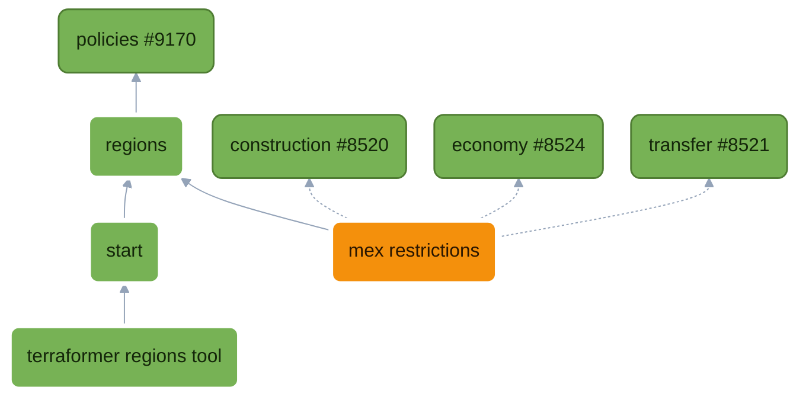

## Mex Splitting User Story

### "None" Mex Splitting

As a **player**, I want nothing to ever change. I will use Chobby with Standard mode, playing Glitters until I die.

### "Map Assigned" Mex Splitting

```md
As a **player**, I want
  to play in lobbies with a set of mexes that are "mine", depending on my start position and the prevailing meta for a given map.
    In game,
      at pre-game start,
        each start's own mex regions are dealt round the players seated at that start, nearest first; regions of a start nobody sits at are dealt round everyone the same way
          if there are too many regions,
            players will receive multiples from the unclaimed pool
          if there are too few regions or invalid regions,
            An error is displayed, "Mex Splitting: Map Assigned is set but mex regions are not configured by the map maker. Please set the 'mex_regions_layout' mod option."
            The game is allowed to proceed with "Mex Splitting: None" behavior.
        I should receive a message informing me that mex building is restricted.
        I should be able to see the mexes that are mine highlighted.
      during the game,
        when building a mex in my own team's territory,
          building a mex in enemy team's territory should be allowed
          for an invalid mex spot,
            I should see
              which mexes I can build (or not) highlighted on the map
              tooltips describing an invalid mex spot
            errors when an existing mex exists (unchanged)
        when a player leaves the game,
          their mex regions should be assigned to their nearest-neighbor, who has been gifted the fewest total number of mex regions
        for allied interactions (like upgrading mexes in my mex regions),
          there is already an orthogonal mod option in transfer that decides that behavior (`unit_sharing_mode`):
            when it lets utility buildings change hands, an ally may build onto my mex on my spot
            otherwise, a spot an ally holds is closed to me
As a **map maker**, I want add regions enclosing specific mexes to display on my map.
  On each region, I need to add
    a required team (example: "north", "south"), from a list of teams
    a required group (example: "tech", "anti_canyon")
    an optional name (example: "tech", "anti_canyon_1", "anti_canyon_2")
  On all regions, I need
    to validate that every mex is circled by a region at least once.
    if a mex spot is contained in two regions, the players holding either region may claim that mex
  I need a save button in Terraformer, so that I can persist my own changes to my bar data directory and see them in my next session.
  I need a publish/Open PR button in Terraformer, so that I can publish my map metadata to other people. (not built: COPY gives the blob, a host `!bset`s it)
As a **BAR Lobby Host**,
  I want to select an option for Mex Splitting: [None, MapAssigned, Shared]
    with tooltips
  (nice to have) if a map doesn't have the metadata to support MapAssigned, warn the lobby
  (nice to have) add a filter to Change Map for only maps with mex regions defined.

As a **Terraformer maintainer**, I want region logic and runtime code out of terraform.
As a **BAR Developer**,
  I want the ability to add a feature that talks about a region, which is an enclosed area on a map.
  I want to be able to extend regions with my own region types, which have: required fields and custom behavior
  I also want to be able to extend existing region types (such as start positions, or mission objective regions) with new behaviors
As a **BAR Maintainer**,
  I would like type checking so any mistakes I make are caught at edit-time and not run-time.
  I would like map metadata changes to be in their own review stream.
As a **BAR AI**,
  I am out of scope for this feature and haven't been considered in depth.
```

### "Shared" Mex Splitting

```md
As a **player**, I want
  to play in lobbies where my team shares all metal income.
    In game,
      at pre-game start,
        I should receive a message informing me that all mex income is shared across the team evenly.
      during the game,
        I should receive mex income equal to my team's total metal extraction income / number of team players.
          (income, not a count of mexes: mexes differ by spot and by tier)
```

## Technical Context

Regions are sort of in terraformer today in the form of start boxes. Regions would also be useful for circling other things on a map, like mexes that you want to be grouped for 1 player -- assuming you want to restrict who can build where. But then you have the problem of how you compose _game behavior_ on top of those regions, so you need [policies](https://github.com/beyond-all-reason/Beyond-All-Reason/pull/9170).

## Proposed Solution Summary

1) Adds a Regions module. Regions are a point or a closed area on a map; they also carry data from the map maker to the runtime.
2) Adds a Start module, which is the if-we-categorize-by-domain module home for any pre-game start logic. Move startbox logic behind the start module, expressed as policies around regions of type "start".
3) Terraformer then interacts with the Regions api to get its list of regions and allows users to select the type of region they want to be looking at/working on, generically. It defines its own `EditorRegion < Region`, with fields specific to editor run-time state defined there (the cached ground-fill mesh and whether it needs rebuilding). Its tools come from the apis of the modules that own them: start lends placement and the exports, transfer lends the mex hull.
4) Transfer module adds a "Mex Splitting" modoption, a new `MexRegion < Region` model in its own directory, and its own policies contributing to existing module behaviors already expressed composably upstream by transfer's required modules: Regions (naming, coverage and description of a mex region), Construction (who holds a spot, the build gate) and Economy (Shared: what extraction pays each team this tick; the engine's answer is the default, Shared answers the ally team's average for metal).

## Start areas

### Intro
The start module is every concern related to game start. That includes player start area selection, the module's first feature.

Start areas are an instructive feature, because they explain the reasons you would want to factor code in this way end to end. I added regions at the very end, after this system was already validated elsewhere, so they were a new feature on top of an existing framework. That allows us to use this document and PR to quickly cover every layer in the framework end to end.

I will try to explain _why_ something is the way it is at every step.

### Start areas

So let's start by putting on our feature engineer hats and model this. The user story is pretty straightforward: have some areas defined on the map, validate the data format in your map editor, save the data format to bar-metadata on map-maker request, enforce runtime requirements on the lua side.

## Regions Module: Naming Regions
Let's start with a simple example to demonstrate policies and how they work.

A policy is a named decision with named steps; each step is a pure function of the context.
* A **Fold** policy's steps each run on the context, and the context is the result
* a **Single** policy's first step to answer wins
* a **Product** policy's steps multiply.

`modules/regions/policies/names.lua`
```lua
  local Policy = require("modules/policy") -- declares policies: Fold, Single, Product, Facts, Contributes

-- Input type - suffixed "Context" on the type or "ctx" in a closure. Generic over the region: regions has no
-- types of its own, so whoever contributes a step says what region it reads
---@class RegionNamesContext<R>
---@field type RegionType
---@field regions R[]
---@field proposed string[]

-- the policy's steps, typed <TInput, TOutput>; a Fold's output is its context.
-- Each step is typed as its own value, so the checker holds the table below to this class.
---@class RegionNamesPolicy: PolicySteps<RegionNamesContext<Region>, RegionNamesContext<Region>>
---@field Label "Label"

-- add our policy to the module's contract type
---@class (partial) RegionsContract
---@field Names RegionNamesPolicy

-- the policy's steps, as the table that runs; the literal sits on the typed local so the checker sees it
---@type RegionNamesPolicy
local Names = {
  Label = "Label",
}
Policy.Fold(Names) -- a Fold: every step runs on the context

-- 
Policies.On(Names).Apply(Names.Label, function(ctx)
  -- this is region module labelling things, so it has nooooo idea and just defaults to the lower case region type
	local label = ctx.type.label:lower()
	for i in ipairs(ctx.regions) do
    -- modify ctx ("Context") in place. This function is part of a Fold Policy<C, C> so ctx (C) is mutated in place here.
		ctx.proposed[i] = label
	end
end)

return { Names = Names } -- the file returns the policies it declares; the loader stamps them with the module and they become the module's contract
```

So all of regions is written this way, extensibly. But for now we're focused on the Start module, so let's see how Start Areas get named there.

## Start Module: Regions Policy

Let's break down the Start regions policy. We are going to go over the policy line by line.

`modules/start/policies/regions.lua`
```lua
```

`modules/start/policies/regions`

The includes here are self-explanatory:
```lua
local Modules = require("modules/enums").Modules
local Policy = require("modules/policy")
local RegionsApi = require("modules/regions/api") -- the regions api
```

We grab the regions policy contract:
```lua
---@type RegionsContract
local Regions = Policies.Contract(Modules.Regions)
```

We do this through the loader because regions has no contract file: its contract is the union of what its policy files return, and only the loader holds that union. EmmyLua holds the type as a global, so we get edit-time enforcement.

The loader is where the handshake is enforced at run-time:
* a step you contribute to must exist
* two files cannot declare the same member
* two modules cannot need each other

Next, we define our region type:

```lua
---@class StartRegion: Region
---@field type "start"
---@field team integer
---@field name string|nil
---@field positions { x: number, z: number }[]|nil
```

Notice how fucking good this is. We have a real domain model that means things to _our_ code. Every field is self-evident because it's written and organized by the _domain_ the file occupies (`modules/start/policies/regions`).

Next is a bit of book keeping. Just like the Regions module names its own behaviors explicitly so other people could  it, we're going to name each of our own behaviors.
```lua
---@class StartRegionsNamesSteps: PolicySteps<RegionNamesContext<StartRegion>, RegionNamesContext<StartRegion>>
       -- the context is regions' NamesContext, over OUR region: the closure below reads region.team with no cast
       -- ^------------------------ "Start" = module name as a prefix (classes are global)
       --       ^------------------ "RegionsNames" = the policy of theirs we extend
       --                  ^------- "Steps" = the policy's named steps
---@field FromTeam "FromTeam"

---@type StartRegionsNamesSteps
local RegionsNames = {
	FromTeam = "FromTeam", -- the name twice: the class is what the checker reads, the table is what runs, and typing the field as its own value holds them together
}
Policy.Contributes(Regions.Names, RegionsNames)
```

Regions exposes its own naming of regions in policies as Regions.Names, and by calling `Policy.Contributes(Regions.Names,...)`, we are saying "I extend region naming" with my own behavior: "FromTeam".

```lua
-- open the chain on OUR steps, not regions': ours are typed over StartRegion, and the loader
-- files the chain under the policy they contribute to
Policies.On(RegionsNames)
	.Apply(RegionsNames.FromTeam, function(ctx)
		for i, region in ipairs(ctx.regions) do -- StartRegion[], no cast
			if region.team ~= nil then
				ctx.proposed[i] = tostring(region.team)
			end
		end
	end)
	.When(RegionsApi.OfType(RegionsApi.Enums.Types.Start)) -- runs for start regions only
```

For clarity here, `RegionsApi.OfType`
```lua
---@param key RegionTypeKey
---@return fun(ctx: any): boolean the precondition a step that is one type's is When'd with: the context is about that type
function Api.OfType(key)
	return function(ctx)
		return ctx.type.key == key
	end
end
```

So that is bit of syntactic sugar (`RegionsApi.OfType(RegionsApi.Enums.Types.Start)`) is equivalent to writing.
```lua
.When(function(ctx)
  ctx.type.key == RegionsApi.Enums.Types.Start
end)
```

Buuuut we want the ability to chain functional code together like this. Composing functions that read like english, IN the Regions module, is extremely powerful for expressing behavior -- behavior more complex than names.

This policy does more, including checking region sets for disjointed areas (which is not allowed in the editor):

```lua
---@class StartRegionsSetSteps: PolicySteps<RegionSetContext<StartRegion>, RegionSetContext<StartRegion>>
---@field AreasDisjoint "AreasDisjoint"

---@type StartRegionsSetSteps
local RegionsSet = {
	AreasDisjoint = "AreasDisjoint",
}

-- we contribute a new step into Regions.Checkset
Policy.Contributes(Regions.CheckSet, RegionsSet)
Policies.On(RegionsSet)
  -- AreasDisjoint is a validation
	.Apply(RegionsSet.AreasDisjoint, function(ctx)
		local label = ctx.type.label:lower()
    -- ensure no two regions overlap
		for i, a in ipairs(ctx.regions) do
			for j, b in ipairs(ctx.regions) do
				if i ~= j and #a.vertices >= 3 and #b.vertices >= 3 and RegionsApi.Overlaps(a.vertices, b.vertices) then
          -- write problems onto context (which is the return) with a helper provided by RegionsApi again
					RegionsApi.ProblemWith(ctx, i, "overlaps " .. label .. " " .. ctx.names[j])
				end
			end
		end
	end)
	.When(RegionsApi.OfType(RegionsApi.Enums.Types.Start))
```

This `AreasDisjoint` policy is aimed at map makers. Evaluate is called against this policy by `modules/regions/api.lua` when it asks regions to check the set.

Here is region's CheckSet:

```lua
-- model our problems:
---@class RegionProblem
---@field message string
---@field region Region|nil
---@field name string|nil
---@field at { x: number, z: number }|nil -- supports navigate-to-error in terraformer

-- this context is interesting! It has a region type R because regions does not
-- implement its own region types (it leaves that to other modules),
-- this is very powerful for letting the regions module define the base type,
-- and then work with other modules regions itself, oblivious to the particulars.
---@class RegionSetContext<R>
---@field type RegionType
---@field regions R[]
---@field names string[]
---@field map RegionMap
---@field problems RegionProblem[]

---@class (partial) RegionMap

-- name the policy
---@class RegionSetSteps: PolicySteps<RegionSetContext<Region>, RegionSetContext<Region>>
---@field Each "Each"

---@class (partial) RegionsContract
---@field CheckSet RegionSetSteps

---@type RegionSetSteps
local CheckSet = {
	Each = "Each",
}
Policy.Fold(CheckSet)

Policies.On(CheckSet).Apply(CheckSet.Each, function(ctx)
	local names = {} ---@type table<Region, string>
	for i, region in ipairs(ctx.regions) do
		names[region] = ctx.names[i]
	end
	for i, region in ipairs(ctx.regions) do
		---@type RegionCheckContext<Region>
		local one = { type = ctx.type, region = region, siblings = ctx.regions, names = names, problems = {} }
		ModuleHandler.Evaluate(ModuleHandler.Contract(Modules.Regions).Check, one)
		for _, problem in ipairs(one.problems) do
			Problems.OfRegion(ctx, i, problem)
		end
	end
end)
```


## Terraformer Changes

Note: how a layout reaches a multiplayer match. `mex_regions_layout` is a hidden mod option carrying `base64url(zlib(json))`, the same encoding and the same decoder as `mapmetadata_startboxes_set` and `mapmetadata_startbox_override`. Terraformer's COPY produces the blob, and a host can take it with `!bset mex_regions_layout <blob>`, the way a startbox override goes in today. That only works once SPADS accepts the new key, so this feature depends on a SPADS change. Two ways to handle that, undecided:
* Open the SPADS PR asking for the new key at the same time as the BAR regions PR, whenever regions is split out. The key stays its own, and the two land together.
* Read the layout from a key SPADS already accepts, such as the startboxes set, so nothing waits on a SPADS merge. The cost is that the startbox payload follows the maps-metadata `startboxesInfo` schema per team count, so mex regions would be riding inside someone else's format, and the startbox parser would have to tolerate them.

Unverified: how SPADS decides which mod option keys it accepts. Check that before choosing.

## Mex Splitting

```lua
local teams = Claims.Rank(ctx.teams, ctx.regions)
local starts = Claims.Seat(teams)
for _, start in ipairs(starts) do
      Claims.Round(start.teams, held, Claims.OwnedBy(start.ordinal))
end
Claims.Round(teams, held, Claims.Not(Claims.OfStart(starts)))
local emptyHanded = Claims.EmptyHanded(ctx.teams, held)
```

Adds the Mex Splitting Dropdown to the Transfer Resources section with three options:
* None  -- first come, first serve
* Shared  -- split a teams metal evenly across players
* Map Assigned -- requires the map maker to define regions  of type "mex_region", grouping the mexes on the map. Falls back to None if preconditions aren't met.

In mex_splitting, we get a layout that looks like this:

```lua
{ regions = {
    start = { ... },
    mex_region = {
      { id = "anti1@1", team = 1, name = "anti1", group = "anti", poly = { { x = 0, y = 0 }, { x = 60, y = 200 } } }, -- two corners: a rect; the codec gives the id, the deal is keyed by it
      { id = "carry@1", team = 1, group = "carry", poly = { { x = 60, y = 40 }, { x = 140, y = 40 }, { x = 100, y = 160 } } }, -- no name: derived from the group on request
    },
} }
```

For **Map Assigned**, **Transfer** decides who may build where, so it defines its own type of Region, using region's own enum as the key:

```lua
local Enums = require("modules/regions/enums")
local Fields = require("modules/start/fields")

return {
	[Enums.Types.MexRegion] = {
		key = Enums.Types.MexRegion,
		label = "Mex region",
		geometries = { Enums.Geometry.Polygon },
		fields = {
			Fields.Team({ required = true }),
			{ key = "group", label = "Group", kind = "string", required = true, suggest = true },
			{ key = "name", label = "Name", kind = "string" },
		},
	},
}
```

## Branch Topology


🟩 no gameplay change  🟧 gameplay change  ⬜ outlined: on this branch. Solid edges are `requires`; dotted edges are edits to a module this PR does not own.

## LLMs
Mostly fable 5.1 for this one. I've validated every line, description is mine, design is mine.


