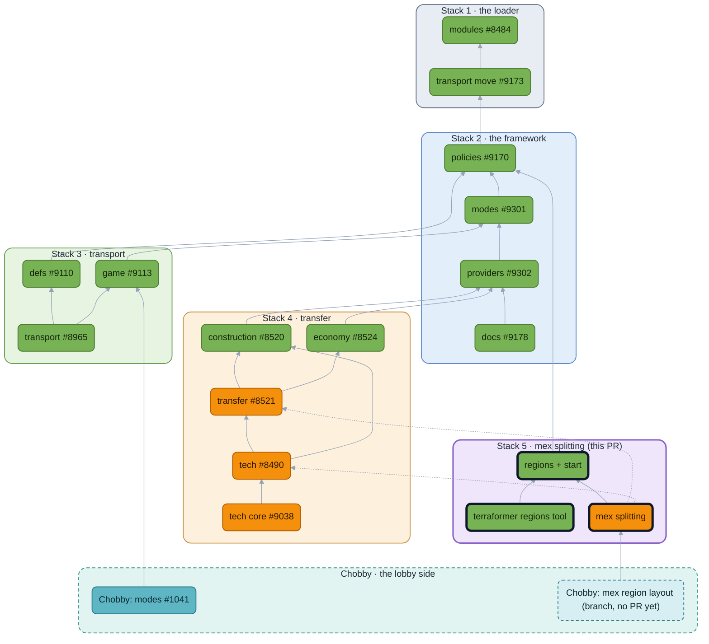

<!-- https://github.com/keithharvey/bar/pull/36 — module: region, start; feature: mex splitting — body as of 2026-09-29 -->

## Mex Splitting User Story

### "None" Mex Splitting

As a **player**, I want nothing to ever change. I will use Chobby with Standard mode, playing Glitters until I die.

### "Map Assigned" Mex Splitting

```md
As a **player**, I want
  to play in lobbies with a set of mexes that are "mine", depending on my start position and the prevailing meta for a given map.
    In game,
      at pre-game start,
        I should receive a message informing me that mex building is restricted.
      when building a mex, I should see:
        which mexes I can build (or not) highlighted on the map
        tooltips describing why that is if I mouse over a particular mex
As a **map maker**, I want add regions enclosing specific mexes to on my map.
  On each region, I need to add
    a required team ("north", "south"), from a list of teams
    a required group ("tech", "anti_canyon").
    an optional name (e.g. "tech", "anti_canyon_1", "anti_canyon_2")
  On all regions, I need
    to validate that every mex is circled by a region at least once.

As a **Terraformer maintainer**, I want region logic and runtime code out of terraform.
As a **BAR developer**,
  I want the ability to add a feature that talks about a region, which is an enclosed area on a map.
  I want to be able to extend regions with my own region types, which have: required fields and custom behavior
  I also want to be able to extend existing region types (such as start positions, or mission objective regions) with new behaviors
As a **BAR maintainer**,
  I would like type checking so any mistakes I make are caught at edit-time and not run-time
```

### "Shared" Mex Splitting

As a **player**, I want
  to play in lobbies where my team shares all metal income is shared.
    In game,
      at pre-game start,
        I should receive a message informing me that all mex income is shared across the team evenly.
      during the game,
        I should receive mex income equal to the cumulative number of team mexes / number of team players.

## Context

Regions are sort of in terraformer today in the form of start boxes. Regions would also be useful for circling other things on a map, like mexes that you want to be grouped for 1 player -- assuming you want to restrict who can build where. But then you have the problem of how you compose _game behavior_ on top of those regions, so you need [policies](https://github.com/beyond-all-reason/Beyond-All-Reason/pull/9170).

## Regions module

Adds a Regions module. Regions are a closed area on a map; they also carry data from the map maker to the runtime.

## Start module
Adds a Start module, which is the home for all of the pre-game start logic. Move startbox logic behind the start module api, expressed as rules around regions of type "start".

## Terraformer regions
Terraformer then interacts with the region module api alone to get lists of regions, edit regions, everything. The module enforces its rules at runtime. It also knows how to draws regions grouped however you want.

It writes data to the data dir on save
<TODO Detail>

Note: and eventually, this data dir file(s) would need to be synced over to a specific map key in rowy.

## Mex Income

Adds the Mex Splitting Dropdown to the Transfer Resources section with three options:
* None  -- first come, first serve
* Shared  -- split a teams metal evenly across players
* Map Assigned -- requires the map maker to define regions  of type "mex_region", grouping the mexes on the map. Falls back to None if preconditions aren't met.

In mex_income, we get a region that looks like this:

```lua
{ regions = {
   start = { -- regions of type startbox
       ...
    } , 
    mex_regions = {
       { team=1, name="anti1", group="anti", poly = { { x = 0, y = 0 }, { x = 60, y = 200 } } },  -- two points: a rect
       { team=1, name="carry", group="carry", poly = { { x = 60, y = 40 }, { x = 140, y = 40 }, { x = 100, y = 160 } } },
       { team=1, name="anti_tech_1", group="anti_tech", poly = ... },
       { team=1, name="anti_tech_2", group="anti_tech", poly = ... },
    }
} }
```

So for **Shareable** Mex Income, **Economy** module controls income distribution, so it defines its own type of Region, using region's own enum as the key:

```lua
local Enums = VFS.Include("modules/regions/enums.lua")

return {
	[Enums.Types.MexRegion] = {
		key = Enums.Types.MexRegion,
		label = "Mex region",
		geometries = { Enums.Geometry.Polygon },
		layoutKey = "regions",
		disjoint = true,
		order = 20,
		fields = {
			{ key = "name", label = "Name", kind = "string", unique = true },
			{ key = "group", label = "Group", kind = "string" },
		},
	},
}
```

## Branch Topology

Two stacks.
1) `regions` and `start` need only the runtime and the policies, and are useful without transfer; with the terraformer tool they are a stack of their own off `policies`.
2) `mex restrictions` is enhancements to modules that already exist in the transfer stack. That can move independently.


🟩 no gameplay change  🟧 gameplay change  🟦 lobby (Chobby)  ⬛ dark outline: this PR  ┄ dashed node: not opened yet. Boxes are the stacks, in merge order. Solid edges are `requires`; dotted edges are edits to a module this PR does not own.

## LLMs
Mostly fable 5.1 for this one. I've validated every line, description is mine, design is mine.


