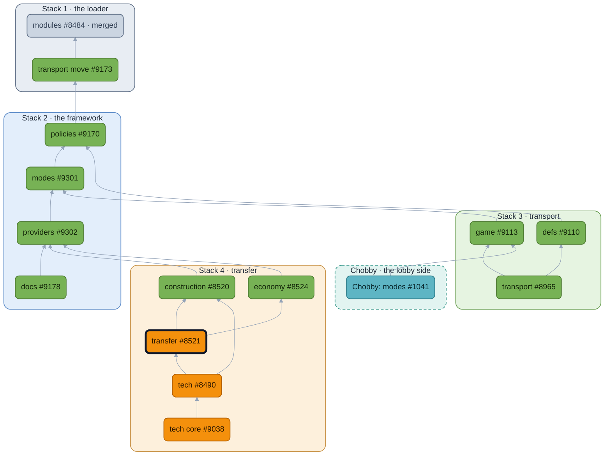

<!-- https://github.com/beyond-all-reason/Beyond-All-Reason/pull/8521 — module: transfer — body as of 2026-09-29 -->

## Context
Units, resources and an empty team's assets all move by the same question: may this pass, at what cost, and who gets told. One policy answers it. Sharing was never really a domain; it was a feature name over this policy plus four construction gadgets and a tech feature. Other modules plug into transfer through declared slots (policy steps, context provisions, per-team terms, tooltip notes), so nothing here includes another module's code. Tech Core is its own PR on top of this one (#9038). Transfer plugs into its neighbours the same way: it fills economy's tax and ledger slots, and contributes the assist-tax affordability gate to construction's build policy (the deduction stays in transfer's gadget; the verdict is construction's).

## User story

```md
As a **player**, I want
  to give an ally a unit, or send them metal or energy, on the terms the lobby set:
    a sharing mode, a tax, a stun on a gifted building, a build delay on a gifted constructor;
  to be told why I cannot, and what would unlock it;
  to take a leaver's units on the lobby's take terms.
As a **BAR Lobby Host**, I want
  one mode to pick: Enabled, Disabled, Easy Tax, Tech Core, Customize.
As a **BAR Developer**, I want
  a pairing's terms to be facts another module may answer,
  construction's build step to be a decision I add a step to,
  and whether utility buildings change hands to be a fact I answer for construction.
```

## What's It Do
### Feature description

> Full architecture & rationale — controllers, policies, the Waterfill solver, and the policy DSL it unlocks — is written up in **[Beyond-All-Reason#8018: Game Controllers & Policies](https://github.com/beyond-all-reason/Beyond-All-Reason/issues/8018)**. Short version:

The engine stops being the economy authority and becomes the economy **data plane** for team redistribution. It keeps measuring (income, pull, expense, per-frame excess) and exposes that state through an API. A registered synced-Lua controller pulls a snapshot on its own cadence, runs redistribution, and writes back its own economy stats directly. (That controller is economy's, in #8524; transfer fills its tax and ledger slots and refreshes its own policy cache when economy stamps a redistribution.) Unit transfers, team giveaways (`GiveEverythingTo`), and `/take` are replaced by game-side gadgets; native overflow sharing is the one piece behind a flag — `nativeExcessSharing = false` hands it to the Lua controller.

On top of that boundary, sharing is configured by **modes** — named presets that set, lock, and hide the individual modoptions. The lobby (Chobby) presents them; the game enforces them. Each modoption stays cardinal (one knob, one behavior) so modes compose them freely.

### Modes

- **Enabled** *(default)* — all sharing on, no tax. Today's game, unchanged.
- **Disabled** — no unit or resource sharing.
- **Easy Tax** — anti-co-op preset. Taxes resource sharing, assist, and resurrection; gifted eco buildings are stunned and mobile constructors build-delayed, so you can't dodge the tax by handing over production. `/take` runs on a stun delay.
- **Tech Core** — tech levels gate what you can build; you raise your level by constructing **Keystone** buildings. Unit sharing and resource tax both scale with tier. Lives in #9038.
- **Customize** — every knob editable; roll your own policy. This is the one mode that preserves the previous mode's values when switching to it, so you can switch from Tech Core to Customize and it behaves exactly like Tech Core. Customize removes a lot of complexity from the other modes, lets people roll a fully customizable mode, gives us every knob needed to prove each modoption is actually orthogonal, and lets users see that the individual modoptions are the implementation details of each top-level mode.

### Other changes

- **Geo/Mex upgrades fixed** (credit Hobo): the unit-sharing filter now lets "Utility" (resource) buildings transfer, so you can upgrade an ally's mex.
- **`/take` moved into the game** (was engine-native), which is what enables the delay/category take modes above.
- **Invalid-unit feedback**: units a mode disallows show in tooltips and highlight when you hover an ally in the player list.

### Demos

- [Sharing modes](https://www.youtube.com/watch?v=SGxRAC0BykQ)
- [Unit sharing functionality](https://youtu.be/yn9U-Q-35Oo)
- [Invalid-unit highlighting](https://youtu.be/37eQF3YlZBE)

## Overview

🟩 no gameplay change  🟧 gameplay change  ⬜ merged  🟦 lobby (Chobby)  ⬛ dark outline: this PR. Boxes are the stacks, in merge order.

## Conclusion
Merging it ships the sharing modes: players see the transfer options and the sharing tab.

## LLMs
Yes. Used for the broad refactors; every name and boundary was chosen by hand and is up for review above.


