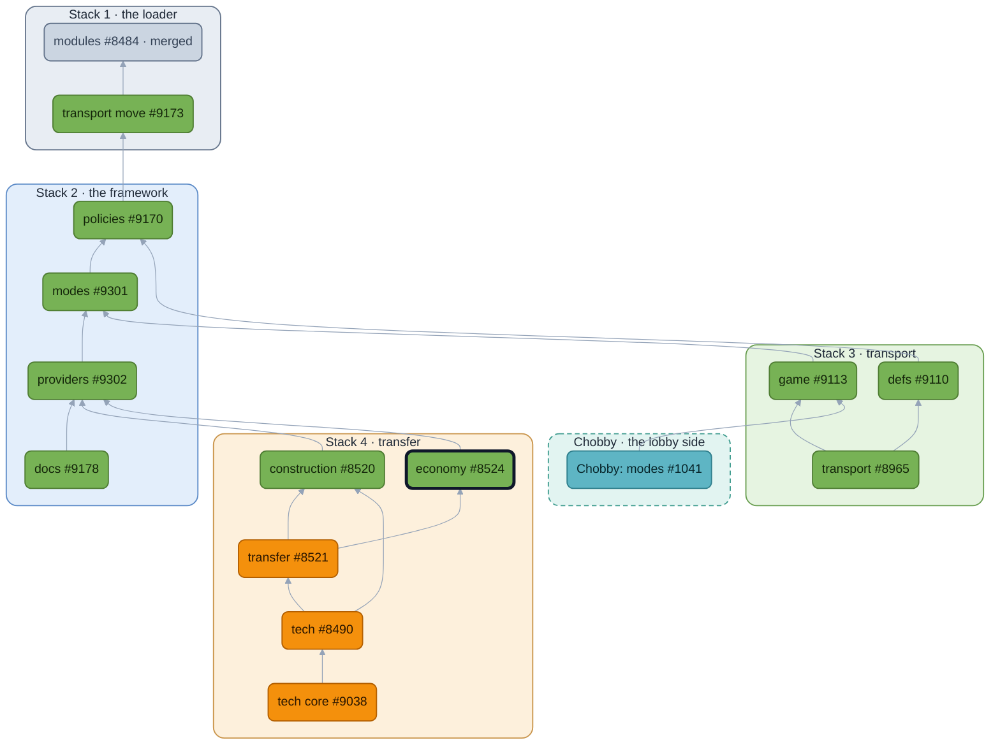

<!-- https://github.com/beyond-all-reason/Beyond-All-Reason/pull/8524 — module: economy — body as of 2026-09-29 -->

## Context
Waterfill answers a question that has nothing to do with allies: given a pool, a set of claimants and their capacities, how much does each get? It sat inside transfer only because allied resource sharing is what asks it today.

## User story

```md
As a **player**, I want
  my overflow to go to allies who have room for it, on a cadence, and none of it wasted while someone does.
As a **BAR Developer**, I want
  the tick to ask two things another module may answer:
    what redistribution costs a team,
    what a tick's results are before they are published.
```

## What's It Do
This PR gives economy the loop that runs it, not just the solver. The Resource Redistribution gadget takes the engine's `ResourceExcess` callin, accumulates overflow, snapshots the teams on a cadence, solves, writes currents and excess stats back, and publishes the share stats. It knows nothing about who is sharing with whom: the two things transfer used to reach in for are now slots in economy's contract file, which transfer fills.

- `distribution.TaxRate`: what redistribution costs a team. Economy asks; transfer answers from its tax rule.
- `redistribution.Results`: a tick's results before they are published. Transfer folds its manual-share ledger in here.

Economy stamps the frame it redistributed on in a game rules param, so anything caching post-redistribution state can refresh without registering a callback.

## Overview

🟩 no gameplay change  🟧 gameplay change  ⬜ merged  🟦 lobby (Chobby)  ⬛ dark outline: this PR. Boxes are the stacks, in merge order.

## Conclusion
Merging it moves resource redistribution into a module. Nothing players see changes until transfer builds on it.

## LLMs
Yes. Used for the broad refactors; every name and boundary was chosen by hand and is up for review above.


