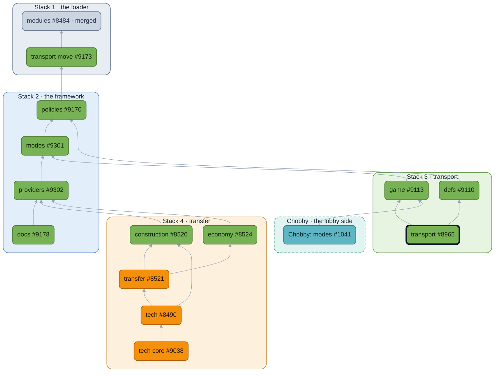

<!-- https://github.com/beyond-all-reason/Beyond-All-Reason/pull/8965 — module: transport — body as of 2026-09-29 -->

## Context
The transport rules as one module. It pulls a long list of existing gadgets and every transport widget in behind it.

## User story

```md
As a **player**, I want
  my transport to pick up what it can, and refuse the rest for a reason I could name:
    not under water, not out of reach,
    not an enemy on the move,
    not an ally's nano unless it is my own.
  it to set a passenger down only where it can stand: dry ground, in reach, and no nano on a slope.
  a loaded transport to fly at its own speed, slowed by a commander aboard when the lobby says so.
As a **BAR Lobby Host**, I want
  to say whether enemies may carry units: everyone, nobody, or everyone but commanders.
As a **BAR Developer**, I want
  to add a rule to load, unload or loaded speed by name, without touching transport's files.
```

## What's It Do
- The decisions are three policies in one file, `policies/transport.lua`. The guards read inline; `lib/rules.lua` keeps only the physics the gadget needs.
- The api publishes `CanCarry`, `CanEverCarry`, `CanLoad`, `MayLoad` and `DefFacts` with no gadget behind them, so a widget can ask the module before it issues an order, and any gate a mod contributes is respected automatically. The factory guard and the load indicators had each grown their own private copy of carry eligibility; both now ask the api.
- The two modoptions that were these rules' dials, `transportenemy` and `comm_trans_slow`, move into the module's own section. Keys and defaults are unchanged, and the game presets claim them so the lobby shows what the active preset governs.
- The `transportenemy` rule that wrote `transportByEnemy` onto every def from inside `alldefs_post` is now transport's `EnemyTransport` step on the defs module's unit def fold, with a spec over both settings; the module requires `defs`.
- Ordering a transport to pick up an ally's nano goes through the load policy too (an `AlliedNano` gate), instead of a rule hidden in `AllowCommand`.
- Step names and typed contexts are published in `contract.lua`, so nothing names a step by string and a contributor's mod predicate references are typed.

One deliberate behavior change: the unload-momentum exception now keys off the `paratrooper` customparam instead of the unit name `cormando`.

**Before this rebases onto modes:** `modules/transport/lib/defs.lua` keeps its unit-fact cache in a file-level `local`, and `api.lua` is included by five files, so five copies fill. It moves into `modules/transport/state.lua` under the state convention the runtime PR sets (one `state.lua` per module, typed, anchored once per Lua state). The parked replay with `State` already exists locally; the cache move is the one change still to make there.

## Overview

🟩 no gameplay change  🟧 gameplay change  ⬜ merged  🟦 lobby (Chobby)  ⬛ dark outline: this PR. Boxes are the stacks, in merge order.

## Conclusion
Merging it moves the transport rules into a module as they are. Nothing players see changes.

## LLMs
Yes. Used for the broad refactors; every name and boundary was chosen by hand and is up for review above.


