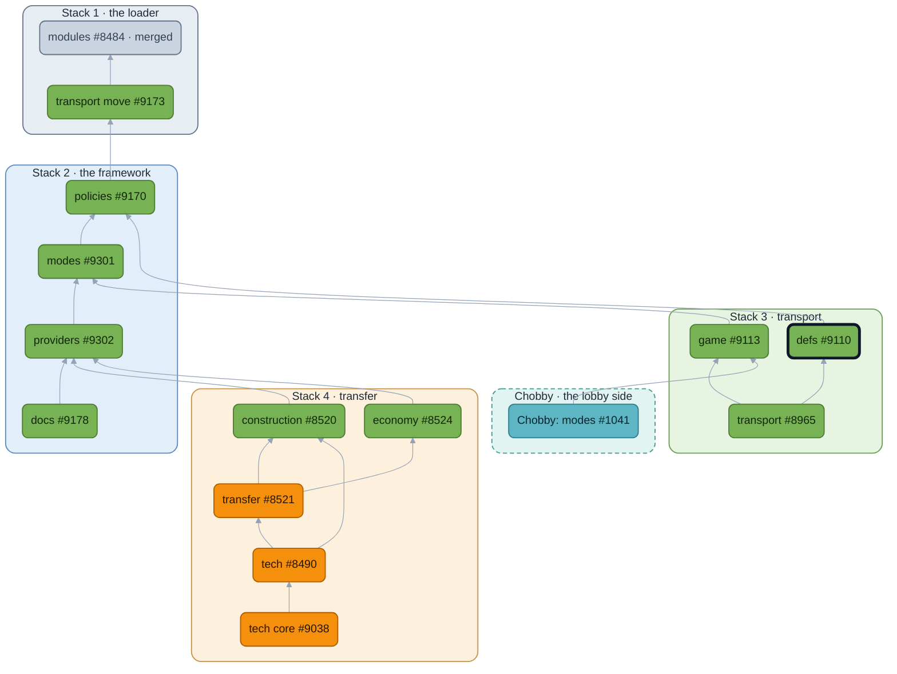

<!-- https://github.com/beyond-all-reason/Beyond-All-Reason/pull/9110 — module: defs — body as of 2026-09-29 -->

## Context
The first module, and the smallest one that could be: def post-processing as a fold.

## User story

```md
As a **player**, I want nothing to change: every def reads as it did.
As a **BAR Developer**, I want
  to change what a unit def or a weapon def says, once, after the engine has read it,
    without editing alldefs_post,
    as a named step every other module can put its own before or after.
```

## What's It Do
`gamedata/unitdefs_post.lua` and `weapondefs_post.lua` evaluate the defs module's `UnitDef` and `WeaponDef` folds once per def. The base game's own pass, `gamedata/alldefs_post.lua`, is the `Base` step of each: included once per Lua state through the module's `state.lua`, so the two post files no longer include it twice. The module is the first to carry its policy inline in `contract.lua`, the form for a module whose whole policy is a few lines. A module that edits defs adds a named step before or after `Base` with `Contributes`; transport's enemy-transport step is the first, up the chain.

What this adds: `modules/defs/` (manifest, a contract with its policy inline, `state.lua`, `api.lua`, a spec) and the two gamedata hooks. What it changes about how defs load: nothing observable. Every def goes through the same pass in the same order; the only difference is that the pass has a name. Merging it should do nothing.

The guide is [`modules/README.md`](https://github.com/beyond-all-reason/Beyond-All-Reason/blob/module-docs/modules/README.md) in the runtime PR; [`modules/REFERENCE.md`](https://github.com/beyond-all-reason/Beyond-All-Reason/blob/module-docs/modules/REFERENCE.md) beside it shows this module's contract whole as its example of a Fold and of a policy carried inline.

## Overview

🟩 no gameplay change  🟧 gameplay change  ⬜ merged  🟦 lobby (Chobby)  ⬛ dark outline: this PR. Boxes are the stacks, in merge order.

## Conclusion
Merging it does nothing observable: every def goes through the same pass in the same order, and the pass has a name.

## LLMs
Yes. Used for the broad refactors; every name and boundary was chosen by hand and is up for review above.


