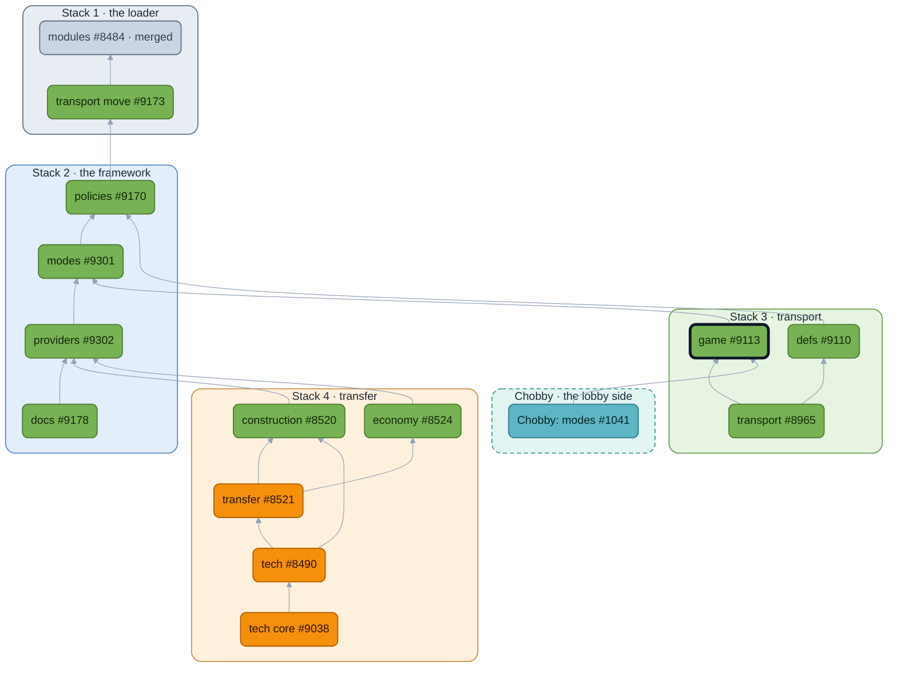

<!-- https://github.com/beyond-all-reason/Beyond-All-Reason/pull/9113 — module: game — body as of 2026-09-29 -->

## Context
The game module: which game this is. one selector, `game_mode`, the presets Standard, FFA, Team FFA and Territorial Domination, and the export the lobby reads. The grammar the presets are written in, `mode_builder`, is in the runtime PR (#8484); it has no vocabulary of its own, and this module binds the game verbs over it. A preset is a whitelist: it claims the options it needs and says which are shown, hidden or locked, and the lobby shows exactly what it claims. Every verb is documented where the editor shows it, `modules/game/types/mode_policy.lua`, with the option it writes.

## What's It Do
A verb lives with its option. The verbs here are for root modoptions nobody owns yet; when a module takes an option into its own `modoptions.lua`, the verb and the presets' claims on it move with it, and this axis shrinks.

What ships:

- A match is exactly one way of being played, so there is one selector, `game_mode`, owned by the mode infrastructure rather than any flavor. The presets are Standard, FFA, Team FFA and Territorial Domination (scavs and raptors would make sense here but putting them into this form met resistance so I left them alone for now).
- Section entries can declare `mode_category` (which axis governs their options) and `mode_key` (which preset reveals them).
- A bare preset verb is a suggestion and leaves its option open. `.Locked()` pins the structure, `.Sealed()` pins the dials as well. Verbs that are rules rather than suggestions come back already pinned.
- Verbs that pick from a list take an enum, not a string: `End`, `Draft` and `Anonymous` refuse anything outside `DeathMode`, `DraftMode` and `AnonymousMode`, which the DSL exports. `UnitRestrictions()` claims every `unit_restrictions_*` toggle at off, so the panel shows them as dials; only `.Sealed()` pins them, since they are dials.
- Rating is part of the preset. A mode that never says `Ranked()` is unranked and carries the `ranked_game` pin like any other claim, so the lobby never has to pin it itself.
- A preset says what it makes live. It makes the module that ships it live for the runtime's fact providers, and `.Uses(contract)` adds another, named by its contract.lua rather than a string. That is how transfer's Customize preset keeps Tech Core's tiered answers while Enabled does not. The runtime walks every combination of presets at load and refuses one that leaves two providers live for one slot (the module runtime, #8484).
- The root `modoptions.lua` appends every module's fragment through `ModuleHandler.ModOptions()`, so a module that ships options needs no change to the root file.
- `modules/game/lib/values.lua` is the one formatter for a mode value on the wire (booleans as `1`/`0`, numbers at float32 precision). The export widget bakes `modes.json` with it and the lobby includes it out of the game archive (beyond-all-reason/BYAR-Chobby#1041), so neither side carries a copy. `tools/headless_testing/startscript_modes_export.txt` runs that export headless, which is what CI and `just spads::stage-modes` use.

The guide is [`modules/README.md`](https://github.com/beyond-all-reason/Beyond-All-Reason/blob/module-docs/modules/README.md) in the runtime PR; its Game section is this PR.

## Overview

🟩 no gameplay change  🟧 gameplay change  ⬜ merged  🟦 lobby (Chobby)  ⬛ dark outline: this PR. Boxes are the stacks, in merge order.

## Conclusion
Merging it adds the Game Mode selector and its four presets to the lobby. The lobby PR, beyond-all-reason/BYAR-Chobby#1041, reads them and merges after this.

## LLMs
Yes. Used for the broad refactors; every name and boundary was chosen by hand and is up for review above.
