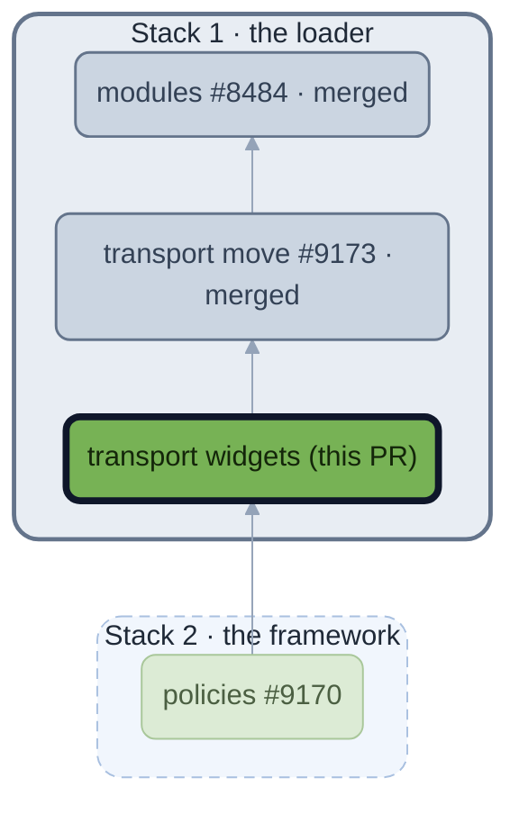

<!-- https://github.com/beyond-all-reason/Beyond-All-Reason/pull/9474 — module: transport (widget move) — body as of 2026-09-29 -->

## Context

#9173 moved transport's nine gadgets into `modules/transport/`. The six widgets that drive transports on the player's side stayed in `luaui/Widgets/`, so #8965 had to move them along with its changes, and a move mixed with edits reads as a rewrite. This gives the widgets the same home first, so #8965 edits two of them in place and leaves the other four alone. (Opened again: the first PR, #9438, was marked merged by GitHub when a stack branch above it took in its commit.)

## What's It Do

A move and nothing else. Area unload, preserved commands after unload, the weight-limit indicator, the turret carry range, loading a moving unit of one's own, and guarding a factory with a transport go from `luaui/Widgets/` to `modules/transport/widgets/`, byte for byte. The module's manifest is already on master with its gadgets, and the loader lists a module's widgets beside the loose ones, so the game runs the same code from the new place.

## Overview

🟩 no gameplay change  🟧 gameplay change  ⬜ merged  🟦 lobby (Chobby)  ⬛ dark outline: this PR  ┄ faded and dashed: the other stacks, for their direct ties: above, what this one is built on; below, what is built on it. Solid edges are `requires`; dotted edges are edits to a module the PR does not own. The whole stack is drawn on [#8534](https://github.com/beyond-all-reason/Beyond-All-Reason/issues/8534).

🤖 Generated with [Claude Code](https://claude.com/claude-code)
