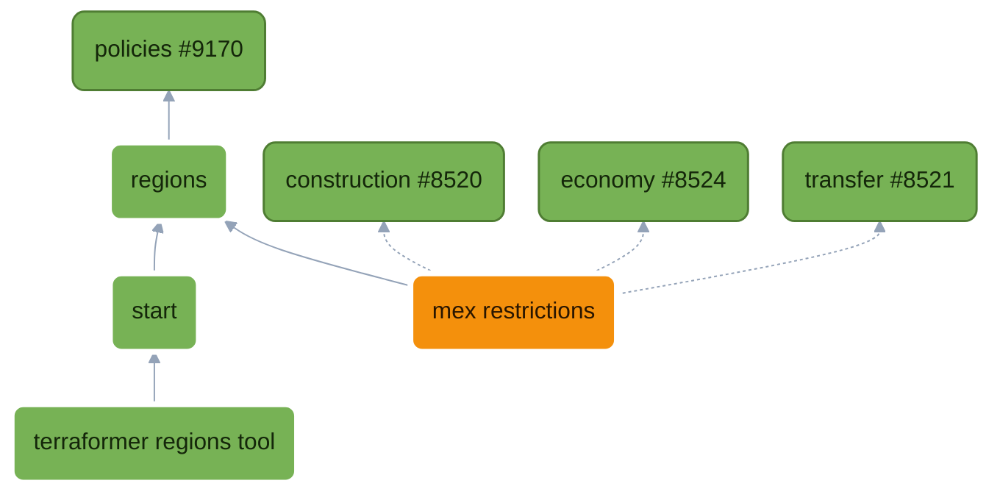

# Start Regions

## Context

Regions are sort of in terraformer today in the form of start boxes. Regions would also be useful for circling other things on a map, like mexes that you want to be grouped for 1 player -- assuming you want to restrict who can build where. But then you have the problem of how you compose _game behavior_ on top of those regions, so you need [policies](https://github.com/beyond-all-reason/Beyond-All-Reason/pull/9170).

## User Story

```md
As a **Player**, I want
  to have clearly marked positions so I can select where to place my command

As a **Map Maker**, I want add start regions that enclose specific areas on my map.
  On each start region, I need to add
    a required team (example: "North", "South"), from a list of teams
    an optional name (example: "North Team Start")
  On all regions, I need to validate that
    there is no overlap
  I need a save button in Terraformer, so that I can persist my own changes to my bar data directory and see them in my next session.
  I need a publish/Open PR button in Terraformer, so that I can publish my map metadata to other people. (not built: COPY gives the blob, a host `!bset`s it)

As a **Terraformer maintainer**, I want region logic and runtime code out of terraform.
As a **BAR Developer**,
  I want the ability to add a feature that talks about a region, which is an enclosed area on a map.
  I want to be able to extend regions with my own region types, which have: required fields and custom behavior
  I also want to be able to extend existing region types (such as start positions, or mission objective regions) with new behaviors
As a **BAR Maintainer**,
  I would like type checking so any mistakes I make are caught at edit-time and not run-time.
  I would like map metadata changes to be in their own review stream.
```

## Functional Decomposition

### Intro

Since Regions sits directly on the policies branch and relies on the middleware it introduced implicitly in its technical implementation. But, for the purposes of this document: I'm going to keep descriptions inline that probably belong on upstream policies READMEs. For now, you don't know what policies are and you want to understand requirements all the way through to having an understanding of regions and why you would want to factor code utilizing this middleware.

So let's start by putting on our feature engineer hats and model this from requirements in Lua.

### Regions

```lua
As a **BAR Developer**,
  I want the ability to add a feature that talks about a region, which is an enclosed area on a map.
```

From `modules/regions/types.lua`

```lua
---@class Region
---@field type RegionTypeKey
---@field id string
---@field vertices { x: number, z: number }[]
---@field kind "point"|"polygon"|"box"|"spline"|nil
---@field name string|nil
```

The region's module itself defines no `RegionTypeKey`. This is left for other modules, which is why we'll be talking about Regions in conjunction with the Start module.

Here is `modules/regions/api.lua:46`:

```lua
---@param typeKey RegionTypeKey
---@param fields table|nil
---@return Region
function Api.Create(typeKey, fields)
	local region = fields or {}
	region.type = typeKey
	region.id = region.id or Identity.Mint()
	region.vertices = region.vertices or {}
	return region --[[@as Region]]
end
```


### Start Regions

```md
As a **Map Maker**, I want add start regions that enclose specific areas on my map.
  On each start region, I need to add
    a required team (example: "North", "South"), from a list of teams
    an optional name (example: "North Team Start")
```


```md
## Regions Module: Naming Regions
Let's start with a simple example to demonstrate policies and how they work.

A policy is a named decision with named steps; each step is a pure function of the context.
* A **Fold** policy's steps each run on the context, and the context is the result
* a **Single** policy's first step to answer wins
* a **Product** policy's steps multiply.

`modules/regions/policies/names.lua`, whole. Then the same file again, a few lines at a time.
```lua
local Policy = require("modules/policy")

---@class RegionNamesContext<R>
---@field type RegionType
---@field regions R[]
---@field proposed string[]

---@class RegionNamesPolicy: PolicySteps<RegionNamesContext<Region>, RegionNamesContext<Region>>
---@field Label "Label"

---@class (partial) RegionsContract
---@field Names RegionNamesPolicy

---@type RegionNamesPolicy
local Names = {
	Label = "Label",
}
Policy.Fold(Names)

Policies.On(Names).Apply(Names.Label, function(ctx)
	local label = ctx.type.label:lower():gsub(" ", "_")
	for i in ipairs(ctx.regions) do
		ctx.proposed[i] = label
	end
end)

return { Names = Names }
```

`Policy` is where policies are declared: `Fold`, `Single`, `Product`, `Facts`, `Contributes`.

```lua
local Policy = require("modules/policy")
```

The input type. It is suffixed "Context" on the type and called `ctx` in a closure. It is generic over the region: regions has no region types of its own, so whoever contributes a step says what region it reads.

```lua
---@class RegionNamesContext<R>
---@field type RegionType
---@field regions R[]
---@field proposed string[]
```

The policy's steps, typed `<TInput, TOutput>`; a Fold's output is its context. Each step is typed as its own value, so the checker holds the table below to this class.

```lua
---@class RegionNamesPolicy: PolicySteps<RegionNamesContext<Region>, RegionNamesContext<Region>>
---@field Label "Label"
```

Add our policy to the module's contract type.

```lua
---@class (partial) RegionsContract
---@field Names RegionNamesPolicy
```

The policy's steps, as the table that runs; the literal sits on the typed local so the checker sees it. Then the shape: a Fold, every step runs on the context.

```lua
---@type RegionNamesPolicy
local Names = {
	Label = "Label",
}
Policy.Fold(Names)
```

The rule. This is the regions module labelling things, so it has nooooo idea and just defaults to the lower case region type. It modifies `ctx` in place: this function is part of a Fold `Policy<C, C>`, so `ctx` (`C`) is mutated here and is the result.

```lua
Policies.On(Names).Apply(Names.Label, function(ctx)
	local label = ctx.type.label:lower():gsub(" ", "_")
	for i in ipairs(ctx.regions) do
		ctx.proposed[i] = label
	end
end)
```

The file returns the policies it declares; the loader stamps them with the module and they become the module's contract.

```lua
return { Names = Names }
```

So all of regions is written this way, extensibly. But for now we're focused on the Start module, so let's see how Start Areas get named there.

## Start Module: Regions Policy

Let's break down the Start regions policy. We are going to go over the policy line by line.

`modules/start/policies/regions.lua`
```lua
local Modules = require("modules/enums").Modules
local Policy = require("modules/policy")
local RegionsApi = require("modules/regions/api")

---@type RegionsContract
local Regions = Policies.Contract(Modules.Regions)

-- Start regions describe what makes them special at run-time
--
---@class StartDescription: RegionDescription
---@field team integer
---@field positions { x: number, z: number }[]

---@class StartRegionsDescribeSteps: PolicySteps<RegionDescribeContext<StartRegion>, StartDescription>
---@field Start "Start"

---@type StartRegionsDescribeSteps
local RegionsDescribe = {
	Start = "Start",
}
Policy.Contributes(Regions.Describe, RegionsDescribe)

Policies.On(RegionsDescribe)
	.Answer(RegionsDescribe.Start, function(ctx)
		return { team = ctx.region.team, positions = ctx.region.positions or {} }
	end)
	.When(RegionsApi.OfType(RegionsApi.Enums.Types.Start))
	.Before(Regions.Describe.Nobody)

-- Start regions are named by team, if present
--   (if a map maker hasn't defined the start region.name via terraformer e.g. "canyon", "carry", etc.)
--
---@class StartRegionsNamesSteps: PolicySteps<RegionNamesContext<StartRegion>, RegionNamesContext<StartRegion>>
---@field FromTeam "FromTeam"

---@type StartRegionsNamesSteps
local RegionsNames = {
	FromTeam = "FromTeam",
}
Policy.Contributes(Regions.Names, RegionsNames)

Policies.On(RegionsNames)
	.Apply(RegionsNames.FromTeam, function(ctx)
		for i, region in ipairs(ctx.regions) do
			if region.team ~= nil then
				ctx.proposed[i] = tostring(region.team)
			end
		end
	end)
	.When(RegionsApi.OfType(RegionsApi.Enums.Types.Start))

-- Start regions do not overlap (validation enforced by the map editor)
--
---@class StartRegionsSetSteps: PolicySteps<RegionSetContext<StartRegion>, RegionSetContext<StartRegion>>
---@field AreasDisjoint "AreasDisjoint"

---@type StartRegionsSetSteps
local RegionsSet = {
	AreasDisjoint = "AreasDisjoint",
}
Policy.Contributes(Regions.CheckSet, RegionsSet)

Policies.On(RegionsSet)
	.Apply(RegionsSet.AreasDisjoint, function(ctx)
		local label = ctx.type.label:lower()
		for i, a in ipairs(ctx.regions) do
			for j, b in ipairs(ctx.regions) do
				if i ~= j and #a.vertices >= 3 and #b.vertices >= 3 and RegionsApi.Overlaps(a.vertices, b.vertices) then
					RegionsApi.ProblemWith(ctx, i, "overlaps " .. label .. " " .. ctx.names[j])
				end
			end
		end
	end)
	.When(RegionsApi.OfType(RegionsApi.Enums.Types.Start))

return { RegionsNames = RegionsNames, RegionsSet = RegionsSet, RegionsDescribe = RegionsDescribe }
```

The includes here are self-explanatory; the last is the regions api:
```lua
local Modules = require("modules/enums").Modules
local Policy = require("modules/policy")
local RegionsApi = require("modules/regions/api")
```

We grab the regions policy contract:
```lua
---@type RegionsContract
local Regions = Policies.Contract(Modules.Regions)
```

We do this through the loader because no module has a contract file: a module's contract is the union of what its policy files return, and only the loader holds that union. EmmyLua holds the type as a global, so we get edit-time enforcement.

The loader is where the handshake is enforced at run-time:
* a step you contribute to must exist
* two files cannot declare the same member
* two modules cannot need each other

Next, our region type. It sits beside the fields the editor shows for it, in `modules/start/region_types.lua`:

```lua
-- A start: an ally team's seat, drawn as the area its positions lie in, or a point.
---@class StartRegion: Region
---@field type "start"
---@field team integer the ally team seated here
---@field positions { x: number, z: number }[]|nil
---@field source string|nil where the match's shape came from: the modoption that set it, or "engine"
```

Notice how fucking good this is. We have a real domain model that means things to _our_ code. Every field is self-evident because it's written and organized by the _domain_ the file occupies (`modules/start`).

Next is a bit of book keeping. Just like the Regions module names its own behaviors explicitly so other people could extend them, we're going to name each of our own behaviors. The name has a shape:

```
StartRegionsNamesSteps
^----                    "Start" = module name as a prefix (classes are global)
     ^-----------        "RegionsNames" = the policy of theirs we extend
                 ^----   "Steps" = the policy's named steps
```

The context is regions' `NamesContext`, over OUR region: the closure further down reads `region.team` with no cast. The step name appears twice: the class is what the checker reads, the table is what runs, and typing the field as its own value holds them together.

```lua
---@class StartRegionsNamesSteps: PolicySteps<RegionNamesContext<StartRegion>, RegionNamesContext<StartRegion>>
---@field FromTeam "FromTeam"

---@type StartRegionsNamesSteps
local RegionsNames = {
	FromTeam = "FromTeam",
}
Policy.Contributes(Regions.Names, RegionsNames)
```

Regions exposes its own naming of regions in policies as Regions.Names, and by calling `Policy.Contributes(Regions.Names,...)`, we are saying "I extend region naming" with my own behavior: "FromTeam".

We open the chain on OUR steps, not regions': ours are typed over `StartRegion` (so `ctx.regions` is `StartRegion[]`, no cast), and the loader files the chain under the policy they contribute to. The `When` at the end means it runs for start regions only.

```lua
Policies.On(RegionsNames)
	.Apply(RegionsNames.FromTeam, function(ctx)
		for i, region in ipairs(ctx.regions) do
			if region.team ~= nil then
				ctx.proposed[i] = tostring(region.team)
			end
		end
	end)
	.When(RegionsApi.OfType(RegionsApi.Enums.Types.Start))
```

For clarity here, `RegionsApi.OfType`
```lua
---@param key RegionTypeKey
---@return fun(ctx: any): boolean the precondition a step that is one type's is When'd with: the context is about that type
function Api.OfType(key)
	return function(ctx)
		return ctx.type.key == key
	end
end
```

So that is bit of syntactic sugar (`RegionsApi.OfType(RegionsApi.Enums.Types.Start)`) is equivalent to writing.
```lua
.When(function(ctx)
	return ctx.type.key == RegionsApi.Enums.Types.Start
end)
```

Buuuut we want the ability to chain functional code together like this. Composing functions that read like english, IN the Regions module, is extremely powerful for expressing behavior -- behavior more complex than names.

This file does more, including checking region sets for disjointed areas (which is not allowed in the editor). We contribute a new step into `Regions.CheckSet`; `AreasDisjoint` is a validation: it ensures no two regions overlap, and writes problems onto the context (which is the return) with a helper provided by `RegionsApi` again.

```lua
---@class StartRegionsSetSteps: PolicySteps<RegionSetContext<StartRegion>, RegionSetContext<StartRegion>>
---@field AreasDisjoint "AreasDisjoint"

---@type StartRegionsSetSteps
local RegionsSet = {
	AreasDisjoint = "AreasDisjoint",
}
Policy.Contributes(Regions.CheckSet, RegionsSet)

Policies.On(RegionsSet)
	.Apply(RegionsSet.AreasDisjoint, function(ctx)
		local label = ctx.type.label:lower()
		for i, a in ipairs(ctx.regions) do
			for j, b in ipairs(ctx.regions) do
				if i ~= j and #a.vertices >= 3 and #b.vertices >= 3 and RegionsApi.Overlaps(a.vertices, b.vertices) then
					RegionsApi.ProblemWith(ctx, i, "overlaps " .. label .. " " .. ctx.names[j])
				end
			end
		end
	end)
	.When(RegionsApi.OfType(RegionsApi.Enums.Types.Start))
```

This `AreasDisjoint` policy is aimed at map makers. Evaluate is called against this policy by `modules/regions/api.lua` when it asks regions to check the set.

Here is region's CheckSet, `modules/regions/policies/check_set.lua`. First we model our problems; `at` is what supports navigate-to-error in terraformer.

```lua
---@class RegionProblem
---@field message string
---@field region Region|nil
---@field name string|nil
---@field at { x: number, z: number }|nil
```

This context is interesting! It has a region type `R` because regions does not implement its own region types (it leaves that to other modules). This is very powerful for letting the regions module define the base type, and then work with other modules' regions itself, oblivious to the particulars.

```lua
---@class RegionSetContext<R>
---@field type RegionType
---@field regions R[]
---@field names string[]
---@field map RegionMap
---@field problems RegionProblem[]

---@class (partial) RegionMap
```

Name the policy, add it to the contract, and stamp its shape:

```lua
---@class RegionSetPolicy: PolicySteps<RegionSetContext<Region>, RegionSetContext<Region>>
---@field Each "Each"

---@class (partial) RegionsContract
---@field CheckSet RegionSetPolicy

---@type RegionSetPolicy
local CheckSet = {
	Each = "Each",
}
Policy.Fold(CheckSet)
```

The rule: check each region on its own, and file its problems on the set.

```lua
Policies.On(CheckSet).Apply(CheckSet.Each, function(ctx)
	local names = {} ---@type table<Region, string>
	for i, region in ipairs(ctx.regions) do
		names[region] = ctx.names[i]
	end
	for i, region in ipairs(ctx.regions) do
		---@type RegionCheckContext<Region>
		local one = { type = ctx.type, region = region, siblings = ctx.regions, names = names, problems = {} }
		ModuleHandler.Evaluate(ModuleHandler.Contract(Modules.Regions).Check, one)
		for _, problem in ipairs(one.problems) do
			Problems.OfRegion(ctx, i, problem)
		end
	end
end)

return { CheckSet = CheckSet }
```

## Terraformer Changes

Note: how a layout reaches a multiplayer match. `mex_regions_layout` is a hidden mod option carrying `base64url(zlib(json))`, the same encoding and the same decoder as `mapmetadata_startboxes_set` and `mapmetadata_startbox_override`. Terraformer's COPY produces the blob, and a host can take it with `!bset mex_regions_layout <blob>`, the way a startbox override goes in today. That only works once SPADS accepts the new key, so this feature depends on a SPADS change. Two ways to handle that, undecided:
* Open the SPADS PR asking for the new key at the same time as the BAR regions PR, whenever regions is split out. The key stays its own, and the two land together.
* Read the layout from a key SPADS already accepts, such as the startboxes set, so nothing waits on a SPADS merge. The cost is that the startbox payload follows the maps-metadata `startboxesInfo` schema per team count, so mex regions would be riding inside someone else's format, and the startbox parser would have to tolerate them.

Unverified: how SPADS decides which mod option keys it accepts. Check that before choosing.

## Mex Splitting

```lua
local teams = Claims.RankRegionsByDistance(ctx.teams, ctx.regions)
local held = {}
Claims.RoundRobin(teams, held, Claims.OwnStart)
Claims.RoundRobin(teams, held, Claims.EmptyStart(ctx.teams))
local emptyHanded = Claims.EmptyHanded(ctx.teams, held)
```

Adds the Mex Splitting Dropdown to the Transfer Resources section with three options:
* None  -- first come, first serve
* Shared  -- split a teams metal evenly across players
* Map Assigned -- requires the map maker to define regions  of type "mex_region", grouping the mexes on the map. Falls back to None if preconditions aren't met.

In mex_splitting, we get a layout that looks like this. Two corners is a rect; the codec gives each region its id and the deal is keyed by it; `team` is the ally team, as the engine numbers it; a region with no name gets one derived from its group on request.

```lua
{ regions = {
    start = { ... },
    mex_region = {
      { id = "anti1@0", team = 0, name = "anti1", group = "anti", poly = { { x = 0, y = 0 }, { x = 60, y = 200 } } },
      { id = "carry@0", team = 0, group = "carry", poly = { { x = 60, y = 40 }, { x = 140, y = 40 }, { x = 100, y = 160 } } },
    },
} }
```

For **Map Assigned**, **Transfer** decides who may build where, so it defines its own type of Region, using region's own enum as the key:

```lua
local Enums = require("modules/regions/enums")
local Fields = require("modules/start/fields")

-- A mex region: an area of the layout whose metal is dealt to the teams seated at one start. The deal is keyed by
-- its id; a name is the map's to give, and Regions.Names derives one from the group otherwise.
---@class MexRegion: Region
---@field type "mex_region"
---@field team integer
---@field group string

return {
	[Enums.Types.MexRegion] = {
		key = Enums.Types.MexRegion,
		label = "Mex region",
		geometries = { Enums.Geometry.Polygon },
		fields = {
			Fields.Team({ required = true }),
			{ key = "group", label = "Group", kind = "string", required = true, suggest = true },
			{ key = "name", label = "Name", kind = "string" },
		},
	},
}
```

## Branch Topology


🟩 no gameplay change  🟧 gameplay change  ⬜ outlined: on this branch. Solid edges are `requires`; dotted edges are edits to a module this PR does not own.

## LLMs
Mostly fable 5.1 for this one. I've validated every line, description is mine, design is mine.


